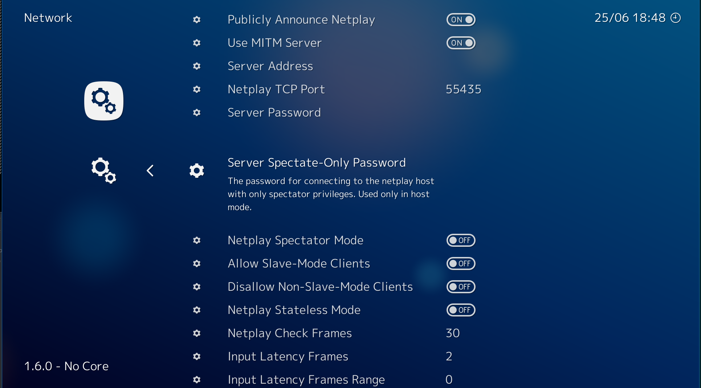

# Netplay Getting Started / FAQ

## FAQ

Does RetroArch require port-forwarding to work?

- Yes, the host needs to forward the ports properly, please read the Setup Guide below.

Does it support more than two players?

- Yes!

RetroArch says *Content not found, try loading content manually* 

- Either load content manually, have the content in your recent history list, or scan your content to a playlist.

Does the core need to be the same version for the server and the client?

- Yes, also some cores may not work for cross-platform netplay.

Which cores work for netplay?

- On a techincal level, every core that supports save states should work but the performance requirements may be too high for it to work in any practical level.

Does PSX / N64 / Dreamcast / Gamecube / Wii / 3DS netplay work?

- No, currently the performance requirements and save state sizes make this too problematic at the moment.

Can I play GB / GBC / GBA / PSP / 3DS games with multiple people via RetroArch Netplay?

- No, RetroArch's netplay is not link-cable emulation, GB, GBA, PSP netplay are currently not possible with our implementation. One notable exception is same game GB/GBC Netplay via the TGB-Dual core.

Can I trade pokemons via RetroArch Netplay?

- No.

## Setup Guide

### Configuring Nickname
- Navigate to **Settings**
- Navigate to **User**
- Select **Username**
- Configure your preferred nickname

### Configure Netplay Server

If you are gonna host a game you don't need to scan content or to build databases. The only thing you need to do is to configure your network parameters and "Start Hosting" from the netplay menu. After doing that just load the content you want to netplay and wait for players.

!!! tip
    If your router doesn't support UPnP or you can't forward your ports or you are uncertain, enable the **Use MITM Server** option. This routes both sides of the connection through our man-in-the-middle server.

!!! tip
    If you want to run a private game you can setup a **Server Password** to prevent random people from connecting. Alternatively you can disable the **Publicly Announce Netplay** option. The clients will need to enter your IP address or hostname directly.

!!! Warning
    RetroArch doesn't check if you managed to open your ports manually, the lobby server doesn't either so make sure you do that properly or enable MITM or people won't be able to connect to your session. You can use [this tool](http://www.yougetsignal.com/tools/open-ports/), enter your **Netplay TCP Port** once you are hosting and it will tell you if the port is open or not.

Once you start hosting you can check your own lobby [here](http://newlobby.libretro.com/list).

### Configure Netplay Clients

You don't need to configure anything to connect to netplay rooms. Browse to the netplay menu, Select **Refresh** and then select the room you want to connect to.

You will be asked for a password if one is required, and if you have matching content scanned or in the **Content History** it will connect right away. Otherwise it will tell you to load the core and content manually and it will attempt to connect right away.

