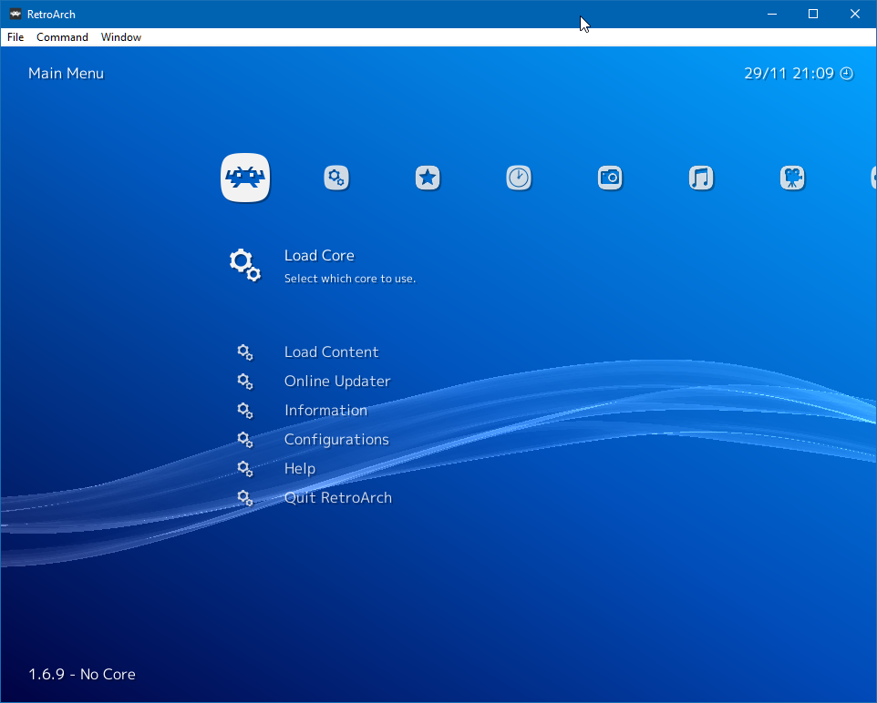

# Getting Started with RetroArch

## Installing and Updating RetroArch

Download a stable release [here](https://buildbot.libretro.com/stable) or a current nightly [here](https://buildbot.libretro.com/nightly/windows/).
There are several files you can download in these folders. For a new installation you want **RetroArch.7z** or the latest setup package (**RetroArch-20XX-XX-XX-setup.exe**).

Both options are identical, the only difference is that one is a self extracting installer, and the other one an archive you have to extract manually. Both are portable installation which means the RetroArch setup is:
- It's self-contained
- It doesn't need users to guess random locations for configurations files
- It's easy to update by just replacing files

If you pick the archive package, extract it in a folder that doesn't require administrator permissions such as *C:\Users\yourusername\RetroArch*. Don't extract it to *Program Files* or your Windows folder. You can update the installation by downloading the latest **20XX-XX-XX-RetroArch.7z** package and overwriting the executable.

If you pick the installer package we recommend to use the default location, follow the installation steps and you should be good to go. You can update the installer version by downloading the latest version and re-running the installer.

!!! Warning
    If you were running a stable release prior to 1.4.0. you will need to update the system libraries. You can do so by downloading the full **RetroArch.7z** package or **redist.7z** from the download locations.

## Using RetroArch

On the first run you will be greeted by this screen:

From here you can launch content, change settigns and build up your content collection

### Basic Navigation

The menu is designed with gamepad navigation in mind but it does have keyboard support. The keyboard controls are:

Manu                        ||In-game      ||
------------- | ------------ |------------- | ------------ 
**Key**       | **Action**   |**Key**       |**Action**
    | Move cursor up                  |    | Menu toggle
  | Move cursor down                |    | Save state
  | Move cursor left                |    | Load state
 | Move cursor right               |    | Increase current state slot
   | Scroll one page down            |    | Decrease current state slot
     | Scroll one page up              |    | Take screenshot
   | Scroll one page down            |    | Mute
       | Select                          |   | Show on-screen keyboard
   | Return to the previous screen   |   | Grab mouse
       | Help                            |  | Volume Up
       | Reset to default                | | Volume Down
       | Search                          | | Fast forward toggle
         | Exit RetroArch                  |     | Fast forward hold
                                                                   |                                 |     | Rewind
                                                                   |                                 |     | Movie record
                                                                   |                                 |     | Pause
                                                                   |                                 |     | Frame advance
                                                                   |                                 |     | Reset
                                                                   |                                 |     | Next shader
                                                                   |                                 |     | Previous shader
                                                                   |                                 |     | Netplay toggle play/spectate
                                                                   |                                 |     | Slow motion
                                                                   
                                                                   

### Gamepad Configuration

XINPUT controllers should work out of the box. If the controller can be autoconfigured the OSD will inform you of the autoconfiguration event.

We also include autoconf profiles for many popular controllers. If your controller doesn't auto configure you can follow this procedure:

- Navigate to **Settings**
- Navigate to **Input**
- Navigate to **Input User 1 Binds**
- Select **User 1 Bind All**
- Press the buttons as required

!!! tip
    If you have several different controller types you may want to use the **User 1 Save Autoconfig** followed by **User 1 Bind Default All** options after binding in order to achieve hotplug functionality

### Directory Configuration

Configuring directories is an important aspect to get the best RetroArch experience possible.
To configure the directories follow these steps:

- Navigate to **Settings**
- Navigate to **Directories**
- Select the directory you want to changed
- Navigate to the desired location

You should always configure the following paths:

- System Directory for *system files*
- Savefile Directory for *save files*
- Savestate Directory *save state files*
- Browser Directory for *your content*

!!! tip
    The **Browser Directory** is used as a startup location which allows easy access to your content library.

### Installing Cores

RetroArch requires cores to run any content. You can download cores directly from RetroArch's interface by following this procedure:

- Navigate to **Online Updater**
- Navigate to **Select Core Updater**
- Select the core you want to download

### Running Content

After you have installed one or more cores you can run your content following this procedure:

- Navigate to **Load Content**
- Browse to the folder that contains the content you want to run
- Select the content that you want to run
- If you have more than one compatible core you will be asked to select the core you want to use for that purpose

!!! tip
    By default loading content will trigger a content scan. If your content matches with any of our databases it will be added to a playlist for easy access. You can find the playlists by navigating to the right of the main menu.

!!! tip
    Every content you launch is added to a history playlist that you can use to load it again quickly at any time

## Glossary

#### frontend
A frontend is a program designed to run libretro cores such as Kodi's RetroPlayer, RetroArch, Phoenix, Minir

#### core
A core is a program that has been ported to the libretro API and runs inside a libretro frontend

#### content
Content can be a game, an image, a video, an audio file that is executed by a core. In most cases contents are the ROMs of an emulated platform

#### retropad
RetroPad is libretro’s input abstraction controller, it’s the interface between the physical controller and the core inputs

#### save files
Save files are saves that are made from within a game, usually cross platform and should work across emulators in most cases

#### save states
Save states are snapshots of the content menory at a particular moment, these are not always cross platform and most certainly won’t work on a different emulator that the one used to create them

#### system files
Additional files that might or not be part of the romset that might be needed to get some content to work (usually referred to by the BIOS term)

#### autoconf
A configuration file that has button definitions for a particular gamepad

