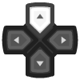

# Title

--Check the display name entry in the relevant core info file (https://github.com/libretro/libretro-super/tree/master/dist/info)--

## Background

--Use Google, Wikipedia, Emulation wikis, Github repository README's and descriptions for information--

### Why use this core?

--Explain why this core is or not suitable for use--
--OPTIONAL SECTION; this is for platforms that have multiple libretro cores e.g. SNES--

### Author(s):

--Check the authors entry in the relevant core info file (https://github.com/libretro/libretro-super/tree/master/dist/info)--
--Use internet aliases whenever possible--

## Contribute to this documentation

In order to propose improvements to this document, [visit it's corresponding source page on github](https://github.com/libretro/docs/tree/master/docs/library/). Changes are proposed using "Pull Requests."

--add relevent corenamed.md to end of link-- 

## See also

[Other Core](https://buildbot.libretro.com/docs/library/)

--OPTIONAL SECTION, add all related cores url endings to end of link--

## License

--Check the license entry in the relevant core info file (https://github.com/libretro/libretro-super/tree/master/dist/info) or check the core's repository for license information--

## Extensions

*Content that can be loaded by the (Core name) core have the following file extensions.*

--Check the supported extensions entry in the relevant core info file (https://github.com/libretro/libretro-super/tree/master/dist/info)--
--Extensions such as cue or m3u will eventually have a hyperlink for their respective guides--

--If no extensions use--
The (Core name) core does not feature extension use.

## Database(s)

*RetroArch databases that are associated with the (Core name) core*

--Check the database entry in the relevant core info file (https://github.com/libretro/libretro-super/tree/master/dist/info)--

## BIOS

*Required or optional firmware files go in RetroArch's system directory.*

|   Filename    |    Description         |              md5sum              |
|:-------------:|:----------------------:|:--------------------------------:|
| optional.bin  | Description - Optional |                                  |
| required.bin  | Description - Required |                                  |

--Check the firmware information in the relevant core info file (https://github.com/libretro/libretro-super/tree/master/dist/info)--

--If no BIOS use--
The (Core name) core does not feature BIOS use.

## Features

-- Use ✔ or ✕ or - --

| Feature           | Supported |
|-------------------|:---------:|
| Saves             | ✕         |
| States            | ✕         |
| Rewind            | ✕         |
| Netplay           | ✕         |
| RetroAchievements | ✕         |
| RetroArch Cheats  | ✕         |
| Native Cheats     | ✕         |
| Controllers       | ✕         |
| Multi-Mouse       | ✕         |
| Rumble            | ✕         |
| Sensors           | ✕         |
| Camera            | ✕         |
| Location          | ✕         |
| Subsystem         | ✕         |

--State support can be tested by attempting to save and load a state in the core--
--If States are supported, that means Rewind and Netplay are supported too--

The (Core name) core creates directories named '(name)' in RetroArch's...

* Savefile directory when the core is loaded.
* Statestate directory when the core is loaded.
* Config directory when a Core Override or a Game Override or a Game-options file is saved.
* Input Remapping directory when a Core Remap or a Game Remap is saved.
* Shaders Presets directory when a Core Preset or a Game Preset is saved.

Core Overrides/Remaps/Presets that are saved will be named '(name)'.

Game Overrides/Remaps/Presets and Game-option files will have the same name as the loaded content.

--Describe what the core reads/writes to and from directories.--

## Options

*The (Core name) core has the following options that can be tweaked from the core options menu. The default setting is bolded.*

- **Core Option** (**Setting1**/Setting2): Description.
- **Core Option 2** (**Setting1**/Setting2): Description.

--If no option use--
The (Core name) core does not feature core options.

## Controllers

--Controllers can be a potentially complex section (e.g. Genesis Plus GX core doc). Unforunately RetroArch's control menu may not have every input so filling out this section may require looking at the core's source code or libretro API documentation (e.g. libretro.cpp, libretro.c and libretro.h) to find what the buttons are bound to.--
--The first columns of the controller graph can be ripped straight from RetroArch's control menu--

*The (Core name) core supports the following controller setting(s), bolded controller settings are the default for the specified user(s):*

### User # Device Type(s)

* **RetroPad** - Joypad without analog or Joypad with Analog or Keyboard or Mouse or Lightgun or Pointer - Optional Description

### Controllers graph

| Core Name | RetroPad                                                       |
|-----------|----------------------------------------------------------------|
| Action 1  |                |
| Action 2  |                |
| Action 3  |            |
| Action 4  |              |
| Action 5  |             |
| Action 5  |           |
| Action 5  |           |
| Action 5  |          |
| Action 6  |                |
| Action 7  |                |
| Action 8  |                    |
| Action 9  |                    |
| Action 10 |               |
| Action 11 |                    |
| Action 12 |                    |
| Action 13 |                    |
| Action 14 |    |
| Action 15 |  |

| RetroKeyboard|
|--------------|

--RetroKeyboard table is optinal, the table is for cores that have keyboard driven device types--

| RetroMouse                                                      |
|-----------------------------------------------------------------|
|                | 
|                  |
|              | 
|                | 
|    | 
|  |

--RetroMouse Table is optional, the table is for cores that have mouse driven device types--

## Compatibility

--Use [(Core name) Core Compatibility List](URL) or make a table--

| Game | Issue |
|------|-------|
|      |       |

--If no compatibility issues--
The (Core name) core does not have specific compatiblity issues

--If no concrete compatiblity information can be found--
Unknown

## External Links

--Standard links but doesn't need to exactly match this--
* [Libretro Repository](https://link)
* [Report Core Issues Here](https://github.com/libretro/libretro-meta)
* [Official Website](https://link)
* [Official Repository](https://link)
