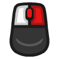

# Title

--Check the display name entry in the corresponding core info file (https://github.com/libretro/libretro-super/tree/master/dist/info)--

--Documentation notice (Put a notice below the core title if this documentation is  currently incomplete or missing crucial information-- 

## Background

--Use Google, Wikipedia, Emulation wikis, Github repository README's and descriptions to find information--

### Why use this core?
--OPTIONAL SECTION--

--This section is for platforms that have multiple libretro cores e.g. SNES--

--Possible topics to talk about--

--Does the core have notable enhancements or differences compared to standalone or other cores?--
--Recommended for Netplay?--
--Is the core designed to run on specific hardware or platforms?--

### Author(s):

--Check the authors entry in the corresponding core info file (https://github.com/libretro/libretro-super/tree/master/dist/info)--
--Use internet aliases whenever possible--

## Contribute to this documentation

In order to propose improvements to this document, [visit it's corresponding source page on github](https://github.com/libretro/docs/tree/master/docs/library/). Changes are proposed using "Pull Requests."

--add relevent corenamed.md to end of link-- 

## See also
--OPTIONAL SECTION--

--Add all related cores url endings to end of link--

[Other Core](https://buildbot.libretro.com/docs/library/)

## License

--Check the license entry in the relevant core info file (https://github.com/libretro/libretro-super/tree/master/dist/info) or check the core's repository for license information--

## Extensions

*Content that can be loaded by the (Core name) core have the following file extensions.*

--Check the supported extensions entry in the relevant core info file (https://github.com/libretro/libretro-super/tree/master/dist/info)--

--If no extensions use--
The (Core name) core does not feature extension use.

## Database(s)
--OPTIONAL SECTION--

*RetroArch databases that are associated with the (Core name) core*

* Database name

--Check the database entry in the relevant core info file (https://github.com/libretro/libretro-super/tree/master/dist/info)--

## BIOS
--OPTIONAL SECTION--

*Required or optional firmware files go in RetroArch's system directory.*

|   Filename    |    Description         |              md5sum              |
|:-------------:|:----------------------:|:--------------------------------:|
| optional.bin  | Description - Optional |                                  |
| required.bin  | Description - Required |                                  |

--Check the firmware information in the corresponding core info file (https://github.com/libretro/libretro-super/tree/master/dist/info)--

## Features

--Use ✔ or ✕--

--State support can be tested by attempting to save and load a state in the core--
--If States are supported, that means Rewind and Netplay are supported too--

| Feature           | Supported |
|-------------------|:---------:|
| Saves             | -         |
| States            | -         |
| Rewind            | -         |
| Netplay           | -         |
| RetroAchievements | -         |
| RetroArch Cheats  | -         |
| Native Cheats     | -         |
| Controllers       | -         |
| Multi-Mouse       | -         |
| Rumble            | -         |
| Sensors           | -         |
| Camera            | -         |
| Location          | -         |
| Subsystem         | -         |

The (Core name) core's directory name is '(name)'

--Describe what the core reads/writes to.--

## Core options
--OPTIONAL SECTION--

*The (Core name) core has the following option(s) that can be tweaked from the core options menu. The default setting is bolded.*

- **Core Option** (**Setting1**/Setting2): Awaiting description.

--Core option screenshots are OPTIONAL--

??? note "Core Option - Setting"
	
	
## Controllers

*The (Core name) core supports the following controller setting(s), bolded controller settings are the default for the specified user(s):*

### User # - # Device Type(s)

* **RetroPad** - Joypad without analog or Joypad with analog or Keyboard or Mouse or Lightgun or Pointer - *Awaiting description.*

* RetroPad w/Analog - Joypad without analog or Joypad with analog or Keyboard or Mouse or Lightgun or Pointer - *Awaiting description.*

### Controllers graph
--OPTIONAL SECTION--

--The controllers graph can be a potentially complex section (e.g. Genesis Plus GX core doc). Unforunately RetroArch's control menu may not have every input so filling out this section may require looking at the core's source code to find what the buttons are bound to.--

--The first columns of the controller graph can be ripped straight from RetroArch's control menu--

| Core Name | RetroPad                                                       |
|-----------|----------------------------------------------------------------|
| Action 1  |                |
| Action 2  |                |
| Action 3  |            |
| Action 4  |              |
| Action 5  |             |
| Action 6  |           |
| Action 7  |           |
| Action 8  |          |
| Action 9  |                |
| Action 10 |                |
| Action 11 |                    |
| Action 12 |                    |
| Action 13 |               |
| Action 14 |                    |
| Action 15 |                    |
| Action 16 |                    |
| Action 17 |    |
| Action 18 |  |

| RetroKeyboard|
|--------------|

--RetroKeyboard table is OPTIONAL, the table is for cores that have keyboard driven device types--

| RetroMouse                                                      |
|-----------------------------------------------------------------|
|                | 
|                  |
|              | 
|                | 
|    | 
|  |

--RetroMouse Table is OPTIONAL, the table is for cores that have mouse driven device types--

## Compatibility
--OPTIONAL SECTION--

--[(Core name) Core Compatibility List](URL)--

| Game | Issue |
|------|-------|
|      |       |

--If no concrete compatiblity information can be found--
Unknown

## External Links

--Example links, they can be different than this--
* [Libretro Repository](https://link)
* [Report Core Issues Here](https://github.com/libretro/libretro-meta)
* [Official Website](https://link)
* [Official Repository](https://link)