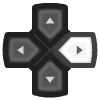
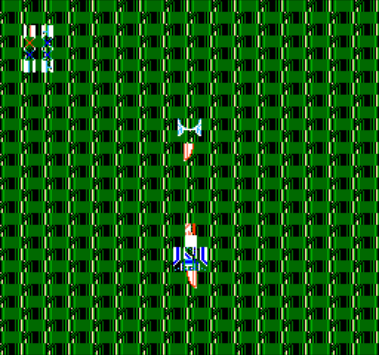

# NES / Famicom (bnes)

## Contribute to this documentation

In order to propose improvements to this document, [visit its corresponding source page on github](https://github.com/libretro/docs/tree/master/docs/library/bnes.md). Changes are proposed using "Pull Requests."

There is a To-Do list for libretro/docs [here](https://docs.libretro.com/docguide/todo/)

You can submit suggestions or issues regarding documentation at the [libretro/docs issue tracker](https://github.com/libretro/docs/issues) or in our [forum thread](https://forums.libretro.com/t/wip-adding-pages-to-documentation-site/10078/).

## Background

A port of bNES v083 to libretro.

### Why use this core?

Awaiting description.

### How to get and install the bnes core:

1. Start up RetroArch. Inside the main menu, go to 'Online Updater'.

2. Just to make sure we have the latest info files, select 'Update Core Info FIles'. Wait until this is done. Then, select 'Core Updater'.

3. Browse through the list and select 'NES / Famicom (bnes)'.

After this has finished downloading, the core should now be ready for use!

#### How to start (after installation):

1. Go back to RetroArch's main menu screen. Select 'Load Content'.

2. Browse to the folder that contains the content you want to run.

3. Select the content that you want to run.

4. If you are asked which core to select, choose 'NES / Famicom (bnes)'.

The content should now start running!

### Authors

- byuu
- Ryphecha

## See also

### NES/Famicom

- [NES / Famicom (Emux NES)](https://docs.libretro.com/library/emux_nes/)
- [NES / Famicom (FCEUmm)](https://docs.libretro.com/library/fceumm/)
- [NES / Famicom (Nestopia UE)](https://docs.libretro.com/library/nestopia_ue/)
- [NES / Famicom (QuickNES)](https://docs.libretro.com/library/quicknes/)

## License

A summary of the licenses behind RetroArch and its cores have found [here](https://docs.libretro.com/tech/licenses/).

- [GPLv3](https://github.com/libretro/bnes-libretro/blob/master/license)

## Extensions

Content that can be loaded by the bnes core have the following file extensions:

- .nes

## Databases

RetroArch database(s) that are associated with the bnes core:

- [Nintendo - Nintendo Entertainment System](https://github.com/libretro/libretro-database/blob/master/rdb/Nintendo%20-%20Nintendo%20Entertainment%20System.rdb)

## Features

RetroArch-level settings or features that the bnes core respects.

| Feature           | Supported |
|-------------------|:---------:|
| Restart           | ✔         |
| Screenshots       | ✔         |
| Saves             | ✔         |
| States            | ✔         |
| Rewind            | ✔         |
| Netplay           | ✔         |
| Core Options      | ✕         |
| RetroAchievements | ✕         |
| RetroArch Cheats  | ✕         |
| Native Cheats     | ✕         |
| Controls          | ✔         |
| Remapping         | ✔         |
| Multi-Mouse       | ✕         |
| Rumble            | ✕         |
| Sensors           | ✕         |
| Camera            | ✕         |
| Location          | ✕         |
| Subsystem         | ✕         |
| Softpatching      | ✔         |
| Disk Control      | ✕         |
| Username          | ✕         |
| Language          | ✕         |
| Crop Overscan     | ✕         |

### Directories

The bnes core's directory name is 'bnes'

The bnes core saves/loads to/from these directories.

**RetroArch's Save directory**

- 'content-name'.srm (Cartridge battery save)

**RetroArch's State directory**

- 'content-name'.state# (State)

### Geometry and timing

- The bnes core's internal FPS is 60
- The bnes core's internal sample rate is 32000 Hz
- The bnes core's core provided aspect ratio is (Ratio)

## Controllers

### Device types

The bnes core supports the following device type(s) in the controls menu, bolded device types are the default for the specified user(s):

#### User 1 - 4 device types

- None - Doesn't disable input.
- **RetroPad** - Joypad
- RetroPad w/Analog - Joypad - There is no reason to switch to this.

### Controller tables

#### Joypad and analog device type table

| Users 1 - 4 Input descriptors | RetroPad Inputs                              |
|-------------------------------|----------------------------------------------|
| B                             |        |
| Select                        |         |
| Start                         |          |
| D-Pad Up                      |        |
| D-Pad Down                    |      |
| D-Pad Left                    |      |
| D-Pad Right                   |     |
| A                             |        |

## Compatibility

| Game                         | Issue                                          |
|------------------------------|------------------------------------------------|
| Crisis Force                 | Graphical glitches. (1)                        |
| Huge Insect                  | No enemies spawn.                              |
| Lagrange Point               | No music.                                      |
| Ms. Pac-Man (Tengen version) | Graphical glitches on the sides of the screen. |
| Skull & Crossbones           | Crashes on start.                              |

??? note "(1)"
    
	
## External Links

- [Libretro bnes Core info file](https://github.com/libretro/libretro-super/blob/master/dist/info/bnes_libretro.info)
- [Libretro bnes Github Repository](https://github.com/libretro/bnes-libretro)
- [Report Libretro bnes Core Issues Here](https://github.com/libretro/bnes-libretro/issues)
- [Official higan Website](https://byuu.org/)
- [Official higan Downloads](https://byuu.org/emulation/higan/)