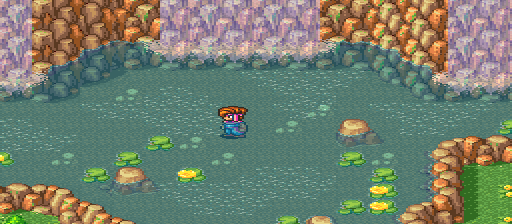

# SNES / Super Famicom (bsnes-mercury Accuracy)

## Background

bsnes-mercury is a fork of higan, aiming to restore some useful features that have been removed, as well as improving performance a bit.
Maximum accuracy is still uncompromisable; anything that affects accuracy is optional and off by default.

This core has been compiled with the Accuracy profile.

### Why use this core?

Improvements include:

* Improved framerate
* Faster ROM loading
* HLE emulation of some special chips is optionally restored (defaults to LLE), to improve performance and reduce reliance on those chip ROMs (they're not really easy to find). Chips for which no HLE emulation was developed (ST-0011 and ST-0018) are still LLE.
* SuperFX overclock is now available (off by default, of course); if enabled, it makes SuperFX look quite a lot smoother.

**The bsnes-mercury cores are not less accurate at default settings than the mainline bsnes cores (you have to explicitly enable 2 core options to switch to the less accurate special chip HLE).**

### Author(s):

byuu|Alcaro

## Contribute to this documentation

In order to propose improvements to this document, [visit it's corresponding source page on github](https://github.com/libretro/docs/tree/master/docs/library/bsnes_mercury_accuracy.md). Changes are proposed using "Pull Requests."

## See also

[Beetle bsnes](https://buildbot.libretro.com/docs/library/beetle_bsnes)

[bsnes Accuracy](https://buildbot.libretro.com/docs/library/bsnes_accuracy)

[bsnes Balanced](https://buildbot.libretro.com/docs/library/bsnes_balanced)

[bsnes C++98 (v085)](https://buildbot.libretro.com/docs/library/bsnes_cplusplus98)

[bsnes Performance](https://buildbot.libretro.com/docs/library/bsnes_performance)

[bsnes-mercury Balanced](https://buildbot.libretro.com/docs/library/bsnes_mercury_balanced)

[bsnes-mercury Performance](https://buildbot.libretro.com/docs/library/bsnes_mercury_performance)

[higan Accuracy](https://buildbot.libretro.com/docs/library/higan_accuracy)

[Snes9x 2002](https://buildbot.libretro.com/docs/library/snes9x_2002)

[Snes9x 2005 Plus](https://buildbot.libretro.com/docs/library/snes9x_2005_plus)

[Snes9x 2005](https://buildbot.libretro.com/docs/library/snes9x_2005)

[Snes9x 2010](https://buildbot.libretro.com/docs/library/snes9x_2010)

[Snes9x](https://buildbot.libretro.com/docs/library/snes9x)

## License

GPLv3

## Extensions

*Content that can be loaded by the bsnes-mercury Accuracy core.*

sfc|smc|bml

## Database(s)

*RetroArch databases that are associated with the bsnes-mercury Accuracy core*

* Nintendo - Super Nintendo Entertainment System

* Nintendo - Super Nintendo Entertainment System Hacks

* Nintendo - Sufami Turbo

## BIOS

*Required or optional firmware files go in RetroArch's system directory.*

The bsnes-mercury Accuracy core uses split ROMS for [special chip games](https://en.wikipedia.org/wiki/List_of_Super_NES_enhancement_chips#List_of_Super_NES_games_that_use_enhancement_chips).

Notable DSP1/DSP1B Games: Super Mario Kart, Pilotwings

Notable DSP2 Games: Dungeon Master

Notable DSP3 Games: SD Gundam GX

Notable DSP4 Games: Top Gear 3000

Notable Cx4 Games: Mega Man X2, Mega Man X3

**The co-processor firmware files for special chip games are only optional when the Allow settings to reduce accuracy core option is enabled and the Special chip accuracy core option is set to HLE. Otherwise, they are required.**

**The ST-0011 and ST-0018 co-processors cannot be HLE'd.**

|   Filename        |    Description                         |              md5sum              |
|:-----------------:|:--------------------------------------:|:--------------------------------:|
| dsp1.data.rom     | DSP1 co-processor firmware             | 3d81b45fa0c2aa8b852dfb1ece7c0971 |
| dsp1.program.rom  | DSP1 co-processor firmware             | ae209fbe789fbf11a48aea5ab1197321 |
| dsp1b.data.rom    | DSP1B co-processor firmware            | 1e3f568634a7d8284020dddc0ae905bc |
| dsp1b.program.rom | DSP1B co-processor firmware            | d10f446888e097cbf500f3f663cf4f6d |
| dsp2.data.rom     | DSP2 co-processor firmware             | e9417e29223b139c3c4b635a2a3b8744 |
| dsp2.program.rom  | DSP2 co-processor firmware             | aa6e5922a3ed5ded54f24247c11143c5 |
| dsp3.data.rom     | DSP3 co-processor firmware             | 0a81210c0a940b997dd9843281008ee6 |
| dsp3.program.rom  | DSP3 co-processor firmware             | d99ca4562818d49cee1f242705bba6f8 |
| dsp4.data.rom     | DSP4 co-processor firmware             | ee4990879eb68e3cbca239c5bc20303d |
| dsp4.program.rom  | DSP4 co-processor firmware             | a151023b948b90ffc23a5b594bb6fef2 |
| cx4.data.rom      | CX4 co-processor firmware              | 037ac4296b6b6a5c47c440188d3c72e3 |
| st010.data.rom    | ST010 co-processor firmware            | 254d70762b6f59f99c27c395aba7d07d |
| st010.program.rom | ST010 co-processor firmware            | 1d70019179a59a566a0bb5d3f2845544 |
| st011.data.rom    | ST011 co-processor firmware            | 10bd3f4aa949737ab9836512c35bcc29 |
| st011.program.rom | ST011 co-processor firmware            | 95222ebf1c0c2990bcf25db43743f032 |
| st018.data.rom    | ST018 co-processor firmware            | 49c898b60d0f15e90d0ba780dd12f366 |
| st018.program.rom | ST018 co-processor firmware            | dda40ccd57390c96e49d30a041f9a9e7 |
| sgb.boot.rom      | SGB Boot Image                         | d574d4f9c12f305074798f54c091a8b4 |

## Features

| Feature           | Supported |
|-------------------|:---------:|
| Saves             | ✓         |
| States            | ✓         |
| Rewind            | ✓         |
| Netplay           | ✓         |
| RetroAchievements | -         |
| RetroArch Cheats  | ✓         |
| Native Cheats     | ✕         |
| Controllers       | ✓         |
| Multi-Mouse       | -         |
| Rumble            | ✕         |
| Sensors           | ✕         |
| Camera            | ✕         |
| Location          | ✕         |
| Subsystem         | ✓         |

The bsnes-mercury Accuracy core creates directories named 'bsnes-mercury' in RetroArch's...

* Savefile directory when the core is loaded.
* Statestate directory when the core is loaded.
* Config directory when a Core Override or a Game Override or a Game-options file is saved.
* Input Remapping directory when a Core Remap or a Game Remap is saved.
* Shaders Presets directory when a Core Preset or a Game Preset is saved.

Core Overrides/Remaps/Presets that are saved will be named 'bsnes-mercury'.

Game Overrides/Remaps/Presets and Game-option files will have the same name as the loaded content.

Game data is saved/loaded to and from the core's save directory.

Save states are saved/loaded to and from the core's state directory.

## Options

*The bsnes-mercury Accuracy core has the following options that can be tweaked from the core options menu. The default setting is bolded.*

- **Allow settings to reduce accuracy** (**Off**/On): Respect accuracy-impacting settings.
- **Special chip accuracy** (**LLE**/HLE): Choose whether to use LLE (real BIOS) or HLE (emulated BIOS) for enhancement chips. HLE is less accurate but also less demanding for the special chips. The Allow settings to reduce accuracy core option must be enabled in order for this to function properly. The ST-0011 and ST-0018 co-processors cannot be HLE'd.
- **SuperFX speed** (**100%**/150%/200%/300%/400%/500%/1000%): Overclock the [SuperFX chip](https://en.wikipedia.org/wiki/Super_FX). The Allow settings to reduce accuracy core option must be enabled in order for this to function properly.
- **System region** (**auto**/ntsc/pal): Choose which region the system is from.
- **Preferred aspect ratio** (**auto**/ntsc/pal): Choose the preferred aspect ratio. RetroArch's aspect ratio must be set to Core provided in the Video seetings. 
- **Crop overscan** (**Off**/On):  Crop out the potentially random glitchy video output that would have been hidden by the bezel around the edge of a standard-definition television screen.
- **Gamma ramp (requires restart)** (**Off**/On): Simulates the way a console’s display device differs from modern computer monitor’s colour reproduction. In particular, it simulates the slightly-different gamma correction used by the Super Famicom.

??? note "Gamma ramp - Disabled"
    
	
??? note "Gamma ramp - Enabled"
    

## Controllers

*The bsnes-mercury Accuracy core supports the following controller setting(s), bolded controller settings are the default for the specified user(s):*

### User 1 Device Type(s)

* **[SNES Joypad](http://nintendo.wikia.com/wiki/Super_Nintendo_Entertainment_System_controller)** - Joypad without analog

* [SNES Mouse](https://en.wikipedia.org/wiki/Super_NES_Mouse) - Mouse

### User 2 Device Type(s)

* **[SNES Joypad](http://nintendo.wikia.com/wiki/Super_Nintendo_Entertainment_System_controller)** - Joypad without analog

* [SNES Mouse](https://en.wikipedia.org/wiki/Super_NES_Mouse) - Mouse

* [Multitap](http://nintendo.wikia.com/wiki/Super_Multitap) - Joypad without analog - allows for up to five players to play together in certain games.

* [SuperScope](https://en.wikipedia.org/wiki/Super_Scope) - Lightgun

* [Justifier](https://en.wikipedia.org/wiki/Konami_Justifier) - Lightgun

* [Justifiers](https://en.wikipedia.org/wiki/Konami_Justifier) - Lightgun - Two Justifiers are plugged in, for two-player Justifier games.

### User 3 - 16 Device Type(s)

* **RetroPad** - Joypad without analog

### Controllers graph

| bsnes mercury Accuracy | RetroPad                                               | *SNES Joypad / Multitap*                                |
|------------------------|--------------------------------------------------------|---------------------------------------------------------|
| B                      |        |            |
| Y                      |        |            |
| Select                 |    |  |
| Start                  |      |    |
| D-Pad Up               |     |      |
| D-Pad Down             |   |      |
| D-Pad Left             |   |      |
| D-Pad Right            |  |      |
| A                      |        |            |
| X                      |        |            |
| L                      |            |            |
| R                      |            |            |

| **RetroMouse**                                                                                                  | *SNES Mouse* | *SuperScope* | *Justifier(s)* |
|-----------------------------------------------------------------------------------------------------------------|--------------|--------------|----------------|
|                                                                | Pointer      | Pointer      | Pointer        |
|                                                                  | Left Button  | Trigger      | Trigger        |
|                                                              |              | ???          |                |
|                                                                | Right Button | Turbo        | Turbo          |
|                                                    |              | Pause        | Pause          |
|                                                  |              | Start        | Start          |
|  +  |              | Reset        | Reset          |

## Compatibility

The bsnes-mercury Accuracy core fully emulates all SNES games that have ever been officially released. 

### Super Gameboy Support

!!! warning
	Super Gameboy support in this core is command-line only, Windows only and has buggy save state support and visual glitches. **Use the [higan Accuracy](https://buildbot.libretro.com/docs/library/higan_accuracy) core for simplified, functional, and easily accessible Super Gameboy support.**

Super Gameboy is supported via the Subsystem API. In RetroArch the Subsystem API is only available via [CLI](https://buildbot.libretro.com/docs/guides/cli-intro/).

For SGB support, you need both the sgb.boot.rom (in RetroArch's system directory) and a SNES Super Game Boy ROM.

To launch SGB games, launch RetroArch like this:
    retroarch -L {path to bsnes core} {path to SNES Super Game Boy ROM} --subsystem sgb {path to GB rom}
	
**Super Game Boy ROM and GB roms must be unzipped**
	
### MSU-1 Support

-	

## External Links

* [Libretro Repository](https://github.com/libretro/bsnes-mercury)
* [Report Core Issues Here](https://github.com/libretro/libretro-meta)
* [Official Website](https://byuu.org/)
* [Official Upstream Downloads](https://byuu.org/emulation/higan/)
