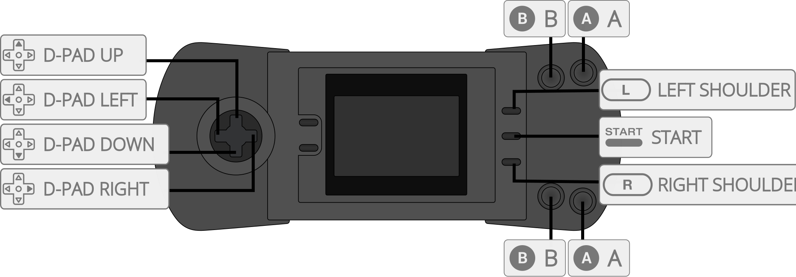

# Atari Lynx (Handy)

## Background

Handy is an Atari Lynx video game system emulator that can be used as a libretro core.  Handy was the original name of the Lynx project that was started at Epyx and then finished by Atari..

Author(s): K. Wilkins

## Contribute to this documentation

In order to propose improvements to this document, [visit it's corresponding source page on github](https://github.com/libretro/docs/blob/master/docs/library/handy.md). Changes are proposed using "Pull Requests."

## License

Zlib

## Extensions

lnx

## BIOS

|   Filename    |    Description        |              md5sum              |
|:-------------:|:---------------------:|:--------------------------------:|
|lynxboot.img   |Lynx Boot Image        | fcd403db69f54290b51035d82f835e7b |

## Feature Support

These are libretro features, not frontend or standalone emulator features.

##### Features:

| Saves | States      | Rewind | Netplay | RetroAchievements | Cheats |
|:-----:|:-----------:|:------:|:-------:|:-----------------:|:------:|
|  yes  |    yes      | yes    |   no    |       no          |  no    |

| Controllers     | Rumble | Sensors | Camera | Location | Subsystem     |
|:---------------:|:------:|:-------:|:------:|:--------:|:-------------:|
|       no        |   no   |   no    |  no    |   no     |      no       |

## Options

The Handy core has the following options that can be tweaked from the core options menu. The default setting is bolded.

- **Display Rotation** (**None**/90/240): Rotates the display.

## Controllers

The Handy core supports one controller setting(s):

* RetroPad

| Handy     | [RetroPad](RetroPad)                                           |
|-----------|----------------------------------------------------------------|
| B         |                |
|           |                |
|           |            |
| Pause     |              |
| D-pad     |                |    
| A         |                |
|           |                |
| Option 1  |                    |
| Option 2  |                    |
|           |               |
|           |                    |
|           |                    |
|           |                    |
|           |    |
|           |  |

Supported combinations

* Option 1 + Pause = Restarts game
* Option 2 + Pause = Flips Screen

## Compatibility

| Game                                  | Issue                          |
|---------------------------------------|--------------------------------|
|**RoadBlasters**                       |Graphics glitches. Minor flickering and glitches after starting a race.|

## External Links

* [Libretro Repository](https://github.com/libretro/libretro-handy)
* [Report Libretro Issues Here](https://github.com/libretro/libretro-meta/issues)
* [Official Website](http://handy.sourceforge.net/)
* [Official Upstream Downloads](http://handy.sourceforge.net/download.htm)

