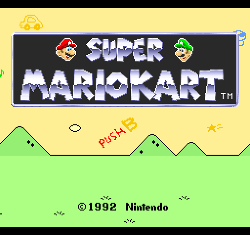
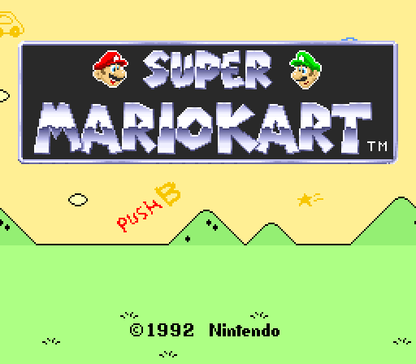
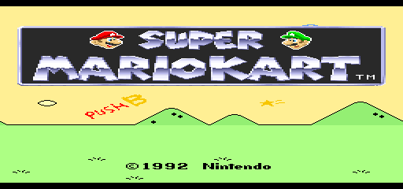
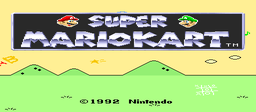
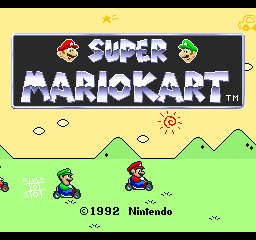
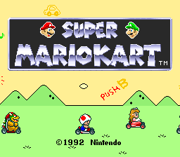
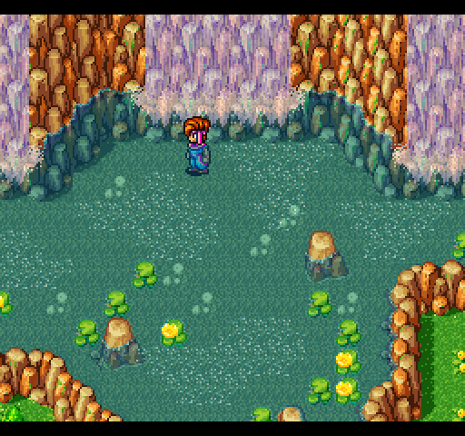
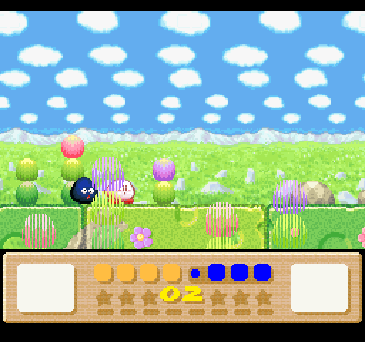
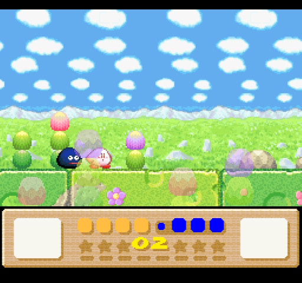
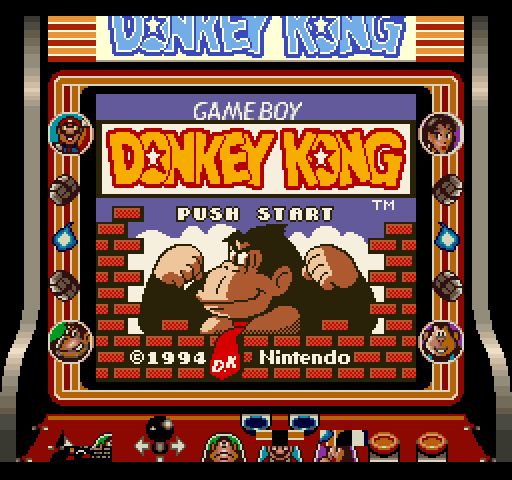

# SNES / Super Famicom (higan Accuracy)

## Background

A port of higan v105's Super Famicom emulation core to libretro. This core is the most in sync with upstream higan.

The Balanced and Peformance profiles were removed in higan v99 so now only the Accuracy profile is available.

### Why use this core?

* Most accurate SNES emulation available.

* Simplified and easily accessible Super Game Boy functionality compared to the other bsnes cores.

### Author(s):

byuu

## Contribute to this documentation

In order to propose improvements to this document, [visit it's corresponding source page on github](https://github.com/libretro/docs/tree/master/docs/library/higan_accuracy.md). Changes are proposed using "Pull Requests."

## See also

[Beetle bsnes](https://buildbot.libretro.com/docs/library/beetle_bsnes)

[bsnes Accuracy](https://buildbot.libretro.com/docs/library/bsnes_accuracy)

[bsnes Balanced](https://buildbot.libretro.com/docs/library/bsnes_balanced)

[bsnes C++98 (v085)](https://buildbot.libretro.com/docs/library/bsnes_cplusplus98)

[bsnes Performance](https://buildbot.libretro.com/docs/library/bsnes_performance)

[bsnes-mercury Accuracy](https://buildbot.libretro.com/docs/library/bsnes_mercury_accuracy)

[bsnes-mercury Balanced](https://buildbot.libretro.com/docs/library/bsnes_mercury_balanced)

[bsnes-mercury Performance](https://buildbot.libretro.com/docs/library/bsnes_mercury_performance)

[Snes9x 2002](https://buildbot.libretro.com/docs/library/snes9x_2002)

[Snes9x 2005 Plus](https://buildbot.libretro.com/docs/library/snes9x_@005_plus)

[Snes9x 2005](https://buildbot.libretro.com/docs/library/snes9x_2005)

[Snes9x 2010](https://buildbot.libretro.com/docs/library/snes9x_2010)

[Snes9x](https://buildbot.libretro.com/docs/library/snes9x)

## License

GPLv3

## Extensions

*Content that can be loaded by the higan Accuracy core have the following file extensions*

sfc|smc|gb|gbc|bml|rom

## Database(s)

*RetroArch databases that are associated with the higan Accuracy core*

* Nintendo - Super Nintendo Entertainment System

* Nintendo - Super Nintendo Entertainment System Hacks

* Nintendo - Game Boy

* Nintendo - Game Boy Color

## BIOS

*Required or optional firmware files go in RetroArch's system directory.*

The higan Accuracy core uses split ROMS for [special chip games](https://en.wikipedia.org/wiki/List_of_Super_NES_enhancement_chips#List_of_Super_NES_games_that_use_enhancement_chips).

Notable DSP1/DSP1B Games: Super Mario Kart, Pilotwings

Notable DSP2 Games: Dungeon Master

Notable DSP3 Games: SD Gundam GX

Notable DSP4 Games: Top Gear 3000

Notable Cx4 Games: Mega Man X2, Mega Man X3

|   Filename             |    Description                         |              md5sum              |
|:----------------------:|:--------------------------------------:|:--------------------------------:|
| dsp1.data.rom          | DSP1 co-processor firmware - Optional  | 3d81b45fa0c2aa8b852dfb1ece7c0971 |
| dsp1.program.rom       | DSP1 co-processor firmware - Optional  | ae209fbe789fbf11a48aea5ab1197321 |
| dsp1b.data.rom         | DSP1B co-processor firmware - Optional | 1e3f568634a7d8284020dddc0ae905bc |
| dsp1b.program.rom      | DSP1B co-processor firmware - Optional | d10f446888e097cbf500f3f663cf4f6d |
| dsp2.data.rom          | DSP2 co-processor firmware - Optional  | e9417e29223b139c3c4b635a2a3b8744 |
| dsp2.program.rom       | DSP2 co-processor firmware - Optional  | aa6e5922a3ed5ded54f24247c11143c5 |
| dsp3.data.rom          | DSP3 co-processor firmware - Optional  | 0a81210c0a940b997dd9843281008ee6 |
| dsp3.program.rom       | DSP3 co-processor firmware - Optional  | d99ca4562818d49cee1f242705bba6f8 |
| dsp4.data.rom          | DSP4 co-processor firmware - Optional  | ee4990879eb68e3cbca239c5bc20303d |
| dsp4.program.rom       | DSP4 co-processor firmware - Optional  | a151023b948b90ffc23a5b594bb6fef2 |
| cx4.data.rom           | CX4 co-processor firmware - Optional   | 037ac4296b6b6a5c47c440188d3c72e3 |
| st010.data.rom         | ST010 co-processor firmware - Optional | 254d70762b6f59f99c27c395aba7d07d |
| st010.program.rom      | ST010 co-processor firmware - Optional | 1d70019179a59a566a0bb5d3f2845544 |
| st011.data.rom         | ST011 co-processor firmware - Optional | 10bd3f4aa949737ab9836512c35bcc29 |
| st011.program.rom      | ST011 co-processor firmware - Optional | 95222ebf1c0c2990bcf25db43743f032 |
| st018.data.rom         | ST018 co-processor firmware - Optional | 49c898b60d0f15e90d0ba780dd12f366 |
| st018.program.rom      | ST018 co-processor firmware - Optional | dda40ccd57390c96e49d30a041f9a9e7 |
| SGB1.sfc/sgb1.boot.rom | SGB Boot BIOS - Optional               | d574d4f9c12f305074798f54c091a8b4 |
| SGB1.sfc/program.rom   | SGB Boot Image - Optional              |                                  |
| SGB2.sfc/sgb2.boot.rom | SGB Boot BIOS - Optional               | d574d4f9c12f305074798f54c091a8b4 |
| SGB2.sfc/program.rom   | SGB Boot Image - Optional              |                                  |

## Features

| Feature           | Supported |
|-------------------|:---------:|
| Saves             | ✔         |
| States            | ✔         |
| Rewind            | ✔         |
| Netplay           | ✔         |
| RetroAchievements | -         |
| RetroArch Cheats  | -         |
| Native Cheats     | ✕         |
| Controllers       | ✔         |
| Multi-Mouse       | -         |
| Rumble            | ✕         |
| Sensors           | ✕         |
| Camera            | ✕         |
| Location          | ✕         |
| Subsystem         | ✕         |

The higan Accuracy core creates directories named 'higan (Super Famicom Accuracy)' in RetroArch's...

* Savefile directory when the core is loaded.
* Statestate directory when the core is loaded.
* Config directory when a Core Override or a Game Override or a Game-options file is saved.
* Input Remapping directory when a Core Remap or a Game Remap is saved.
* Shaders Presets directory when a Core Preset or a Game Preset is saved.

Core Overrides/Remaps/Presets that are saved will be named 'higan (Super Famicom Accuracy)'. 

Game Overrides/Remaps/Presets and Game-option files will have the same name as the loaded content.

Game data is saved/loaded to and from the core's save directory.

Save states are saved/loaded to and from the core's state directory. 

## Options

*The higan Accuracy core has the following options that can be tweaked from the core options menu. The default setting is bolded.*

- **Internal resolution** (**512x480**/512x448/512x240/512x224/256x240/256x224): Self-explanatory.

??? note "512x480"
    

??? note "512x448"
    

??? note "512x240"
    

??? note "512x224"
    

??? note "256x240"
    

??? note "256x224"
    

- **Color emulation** (**Off**/On): Simulates the way a console’s display device differs from modern computer monitor’s colour reproduction. In particular, it simulates the slightly-different gamma correction used by the Super Famicom.

??? note "Color emulation - Disabled"
    

??? note "Color emulation - Enabled"
    

- **Blur emulation**  (**Off**/On):  Simulates the limited horizontal resolution of standard-definition TVs by blurring together horizontally-adjacent pixels. Games like Jurassic Park for the Super Famicom depend on this to emulate a transparency effect.

??? note "Blur emulation - Disabled"
    

??? note "Blur emulation - Enabled"
    

- **Scanline emulation** (**Off**/On): **Currently does not function properly**
- **Preferred Super GameBoy BIOS (restart)** (**SGB1.sfc/**/SGB2.sfc/) Choose what Super GameBoy BIOS you want to use.

## Controllers

*The higan Accuracy core supports the following controller setting(s), bolded controller settings are the default for the specified user(s):*

### User 1 Device Type(s)

* **[SNES Joypad](http://nintendo.wikia.com/wiki/Super_Nintendo_Entertainment_System_controller)** - Joypad without analog

* [SNES Mouse](https://en.wikipedia.org/wiki/Super_NES_Mouse) - Mouse

### User 2 Device Type(s)

* **[SNES Joypad](http://nintendo.wikia.com/wiki/Super_Nintendo_Entertainment_System_controller)** - Joypad without analog

* [SNES Mouse](https://en.wikipedia.org/wiki/Super_NES_Mouse) - Mouse

* [Multitap](http://nintendo.wikia.com/wiki/Super_Multitap) - Joypad without analog - allows for up to five players to play together in certain games.

* [SuperScope](https://en.wikipedia.org/wiki/Super_Scope) - Lightgun

* [Justifier](https://en.wikipedia.org/wiki/Konami_Justifier) - Lightgun

* [Justifiers](https://en.wikipedia.org/wiki/Konami_Justifier) - Lightgun - Two Justifiers are plugged in, for two-player Justifier games.

### User 3 - 16 Device Type(s)

* **RetroPad** - Joypad without analog

### Controllers graph

| bsnes mercury Accuracy | RetroPad                                               | *SNES Joypad / Multitap*                                |
|------------------------|--------------------------------------------------------|---------------------------------------------------------|
| B                      |        |            |
| Y                      |        |            |
| Select                 |    |  |
| Start                  |      |    |
| D-Pad Up               |     |      |
| D-Pad Down             |   |      |
| D-Pad Left             |   |      |
| D-Pad Right            |  |      |
| A                      |        |            |
| X                      |        |            |
| L                      |            |            |
| R                      |            |            |

| RetroMouse                                                                                                      | *SNES Mouse* | *SuperScope* | *Justifier(s)* |
|-----------------------------------------------------------------------------------------------------------------|--------------|--------------|----------------|
|                                                                | Pointer      | Pointer      | Pointer        |
|                                                                  | Left Button  | Trigger      | Trigger        |
|                                                              |              | ???          |                |
|                                                                | Right Button | Turbo        | Turbo          |
|                                                    |              | Pause        | Pause          |
|                                                  |              | Start        | Start          |
|  +  |              | Reset        | Reset          |

## Compatibility

The higan Accuracy core fully emulates all SNES games that have ever been officially released.

Incompatible with ROM hacks made to take advantage of emulator quirks, much like real hardware.

### Super Gameboy Support

The higan Accuracy core uses a simplified Super Game Boy routine that makes it much easier to access this feature than with the old v094-based cores. Instead of using the complex, CLI-based 'subsystem' launch commands, it looks for the necessary files in the system/BIOS directory whenever you feed the core a *.gb/c file.

To get it working, you'll need one or more Super Game Boy ROMs and the sgb.boot.rom BIOS.

**Step 1**

Make 2 subdirectories in RetroArch's system directory, one named SGB1.sfc and the other named SGB2.sfc.

**Step 2**

Copy your original Super Game Boy ROM into the SGB1.sfc directory and then rename it to program.rom. Copy your Super Game Boy 2 ROM into the SGB2.sfc directory and then rename it program.rom, as well.

**Step 3**

Copy your sgb.boot.rom BIOS into each of your SGB1.sfc and SGB2.sfc directories, and rename them to sgb1.boot.rom and sgb2.boot.rom, respectively. 

There's a core option to choose which of the two SGB BIOSes you want to use.

**Step 4**

Load a SGB-supported GB/GBC rom.

**Done**

### MSU-1 Support

-

## External Links

* [Libretro Repository](https://gitlab.com/higan/higan)
* [Report Core Issues Here](https://github.com/libretro/libretro-meta)
* [Official Website](https://byuu.org/)
* [Official Upstream Downloads](https://byuu.org/emulation/higan/)
