# NES / Famicom (Nestopia UE)

## Background

Nestopia is a portable and cycle-accurate NES/Famicom emulator written in C++. Nestopia UE (Undead Edition) is a fork of the original source code, with enhancements from members of the emulation community. This includes support for new platforms, and bug fixes in the emulator core. 

### Why use this core?

-

### Author(s)

Martin Freij|R. Belmont|R. Danbrook

## Contribute to this documentation

In order to propose improvements to this document, [visit it's corresponding source page on github](https://github.com/libretro/docs/tree/master/docs/library/nestopia_ue.md). Changes are proposed using "Pull Requests."

## See also

[NES / Famicom (bnes)](https://doc.libretro.com/library/bnes/)

[NES / Famicom (Emux)](https://doc.libretro.com/library/emux_nes/)

[NES / Famicom (FCEUmm)](https://doc.libretro.com/library/fceumm/)

[NES / Famicom (QuickNES)](https://doc.libretro.com/library/quicknes/)

## License

GPLv2

## Extensions

*Content that can be loaded by the Nestopia UE core have the following file extensions.*

nes|fds|unf|unif

## Database(s)

*RetroArch database(s) that are associated with the Nestopia UE core*

* Nintendo - Nintendo Entertainment System

* Nintendo - Family Computer Disk System

## BIOS

*Required or optional firmware files go in RetroArch's system directory.*

|   Filename      |    Description                                                                |              md5sum              |
|:---------------:|:-----------------------------------------------------------------------------:|:--------------------------------:|
| [NstDatabase.xml](https://doc.libretro.com/library/nestopia_ue/index.html#nstdatabasexml) | Nestopia Database file UE - **Required for proper emulation. HIGHLY RECOMMENDED** | |
| disksys.rom     | Family Computer Disk System BIOS - Required for Famicom Disk System emulation | ca30b50f880eb660a320674ed365ef7a |
| custom.pal      | Custom NES Palette - Optional                                                 |                                  |

## Features

| Feature           | Supported |
|-------------------|:---------:|
| Saves             | ✔         |
| States            | ✔         |
| Rewind            | ✔         |
| Netplay           | ✔         |
| RetroAchievements | ✕         |
| RetroArch Cheats  | ✕         |
| Native Cheats     | ✕         |
| Controllers       | ✔         |
| Remapping         | ✔         |
| Multi-Mouse       | -         |
| Rumble            | ✕         |
| Sensors           | ✕         |
| Camera            | ✕         |
| Location          | ✕         |
| Subsystem         | ✕         |

The Nestopia UE core's directory name is 'Nestopia'

Game data is saved/loaded to and from where save files are stored.

Save states are saved/loaded to and from where state files are stored. 

### Custom color palettes

To use custom color palettes in the Nestopia UE core, the custom color palette file you want to use must be in RetroArch's system directory. Make sure the custom palette file is named 'custom.pal'

Custom color palettes for the NES can be generated with either of these tools.

[Bisqwit's NTSC NES palette generator](http://bisqwit.iki.fi/utils/nespalette.php)

[Drag's NTSC NES palette generator](http://drag.wootest.net/misc/palgen.html)

### NstDatabase.xml

**It is HIGHLY RECOMMENDED you have NstDatabase.xml in RetroArch's system directory, you can get it from [https://github.com/rdanbrook/nestopia](https://github.com/rdanbrook/nestopia)**

The Nestopia UE core relies on the NstDatabase.xml database file for 

* Games that support a custom mapper

* Games that support multitap accessories

* Games that support the Zapper

* ROM Hacks

* Famicom Disk System games

* General proper emulation of games

**Many games will have issues if NstDatabase.xml is not present in RetroArch's system directory.**

## Core options

*The Nestopia UE core has the following option(s) that can be tweaked from the core options menu. The default setting is bolded.*

- **Blargg NTSC filter** (**Off**/composite/svideo/rgb/monochrome): Enable Blargg NTSC filters.

!!! warning ""
	These 'Blargg NTSC filter' core option screenshots have been taken with the 'Palette' core option set to cxa2025as.

??? note "Blargg NTSC filter - Off"
	
	
??? note "Blargg NTSC filter - composite"
	

??? note "Blargg NTSC filter - svideo"
	

??? note "Blargg NTSC filter - rgb"
	

??? note "Blargg NTSC filter - monochrome"
		
	
- **Palette** (**cxa2025as**/consumer/canonical/alternative/rgb/pal/composite-direct-fbx/pvm-style-d93-fbx/ntsc-hardware-fbx/nes-classic-fbx-fs/raw/custom): Choose which color palette is going to be used.

!!! warning ""
	These 'Palette' core option screenshots have been taken with the 'Blargg NTSC filter' core option set to Off.

??? note "Palette - cxa2025as"
	

??? note "Palette - consumer"
	

??? note "Palette - canonical"
	
	
??? note "Palette - alternative"
	

??? note "Palette - rgb"
	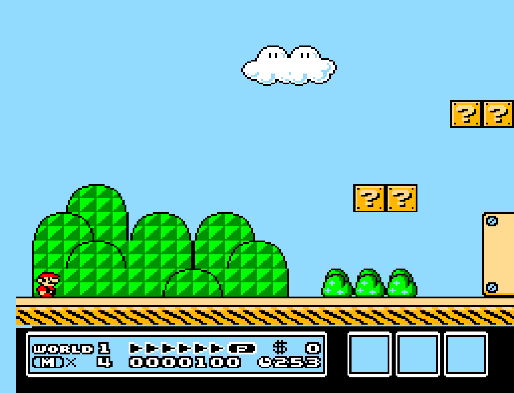

??? note "Palette - pal"
	

??? note "Palette - composite-direct-fbx"
	

??? note "Palette - pvm-style-d93-fbx"
	

??? note "Palette - ntsc-hardware-fbx"
	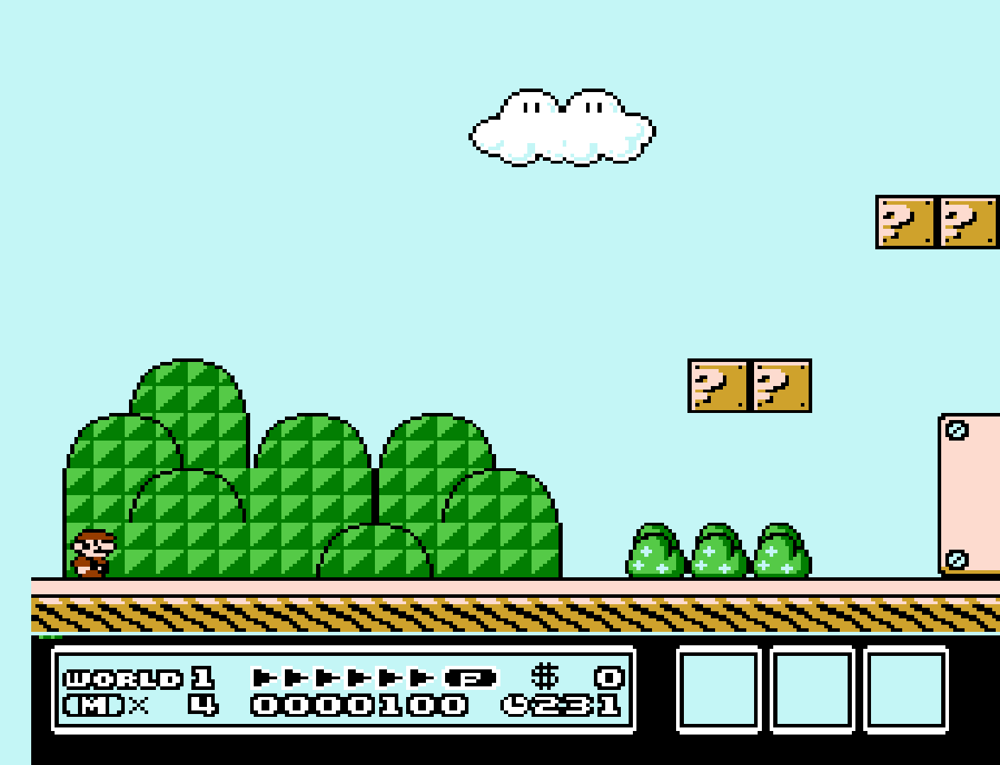

??? note "Palette - nes-classic-fbx-fs"
	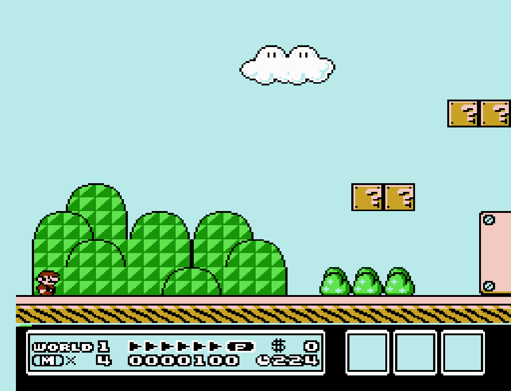

??? note "Palette - raw"
	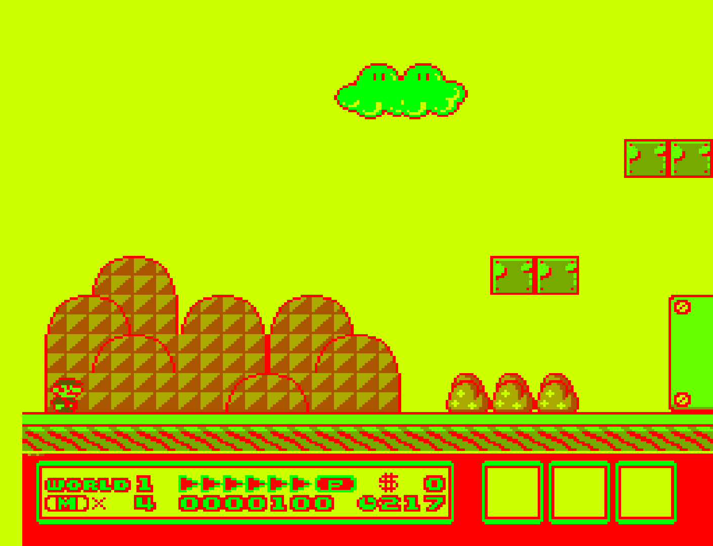
	
- **Remove 8-sprites-per-scanline hardware limit** (**Off**/On): Self-explanatory.
- **CPU Speed (Overclock)** (**1x**/2x): Overclock the emulated CPU.
- **Automatically insert first FDS disk on reset** (Off/**On**): Self-explanatory.
- **Mask Overscan (Vertical)** (Off/**On**): Mask out (vertically) the potentially random glitchy video output that would have been hidden by the bezel around the edge of a standard-definition television screen.

??? note "Mask Overscan (Vertical) - On"
	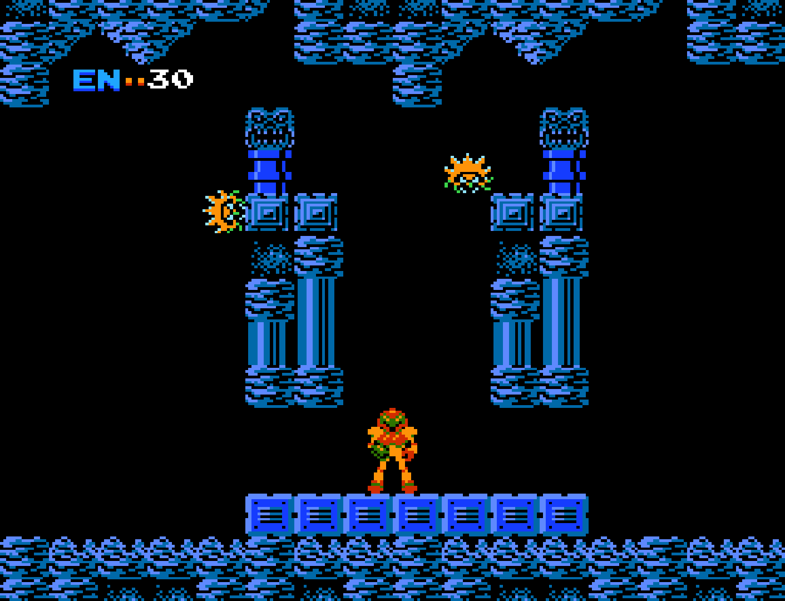
	
??? note "Mask Overscan (Vertical) - Off"
	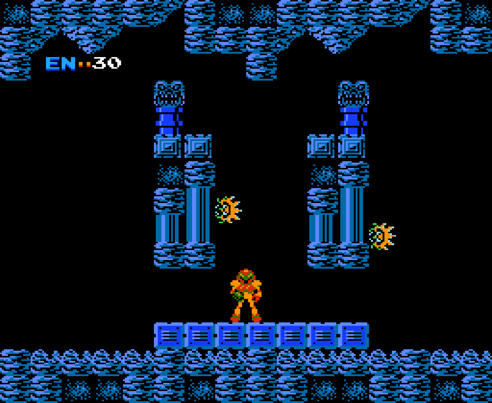

- **Mask Overscan (Horizontal)** (**Off**/On): Mask out (horizontally) the potentially random glitchy video output that would have been hidden by the bezel around the edge of a standard-definition television screen.

??? note "Mask Overscan (Horizontal) - Off"
	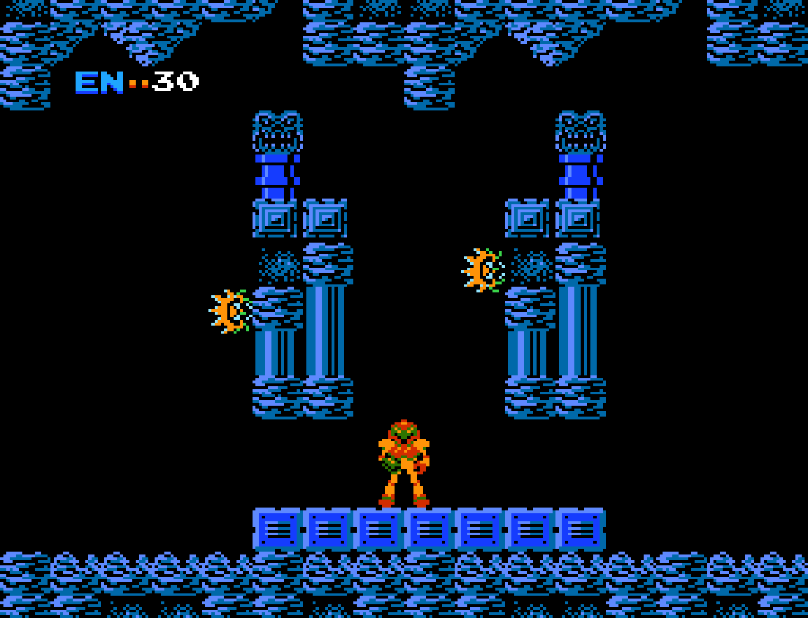
	
??? note "Mask Overscan (Horizontal) - On"
	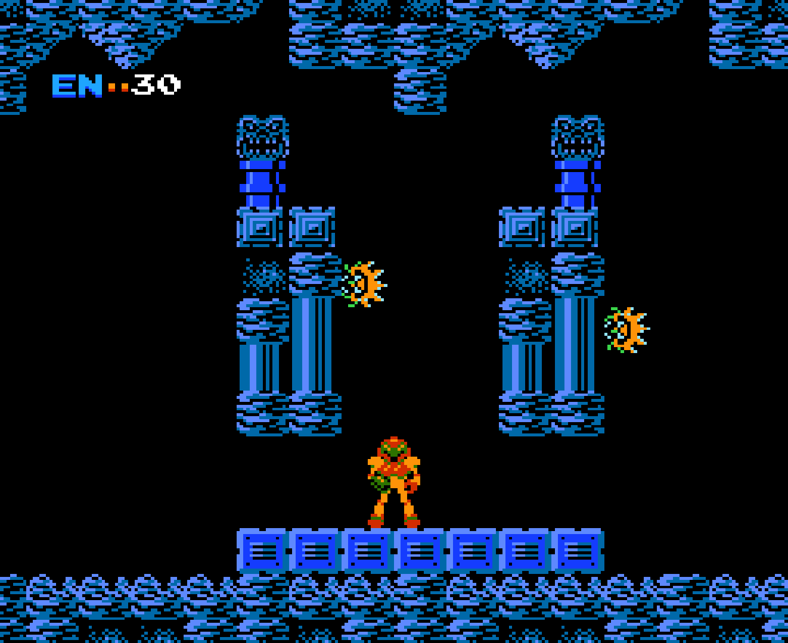

- **Preferred aspect ratio** (**auto**/ntsc/pal/4:3): Choose the preferred aspect ratio. RetroArch's aspect ratio must be set to Core provided in the Video seetings. 'auto' will use the [NstDatabase.xml](https://doc.libretro.com/library/nestopia_ue/index.html#nstdatabasexml) database file for aspect ratio autodetection. If there is no database present it will default to NTSC for 'auto'.

??? note "Preferred aspect ratio - ntsc"
	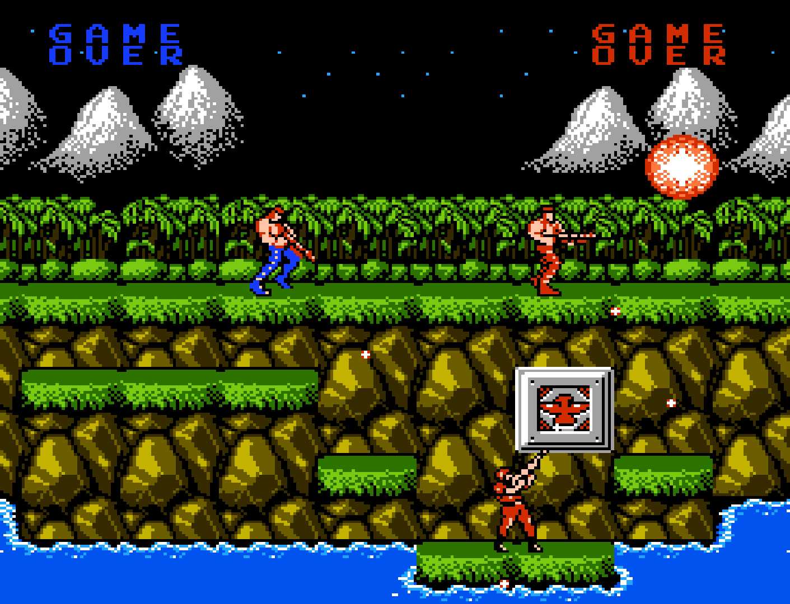
	
??? note "Preferred aspect ratio - pal"
	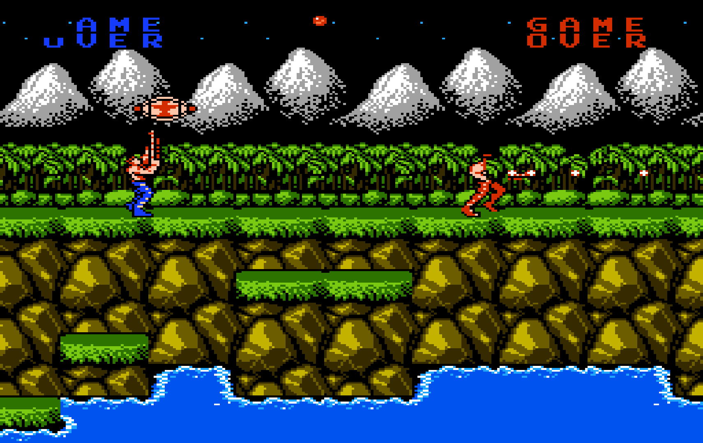
	
??? note "Preferred aspect ratio - 4:3"
	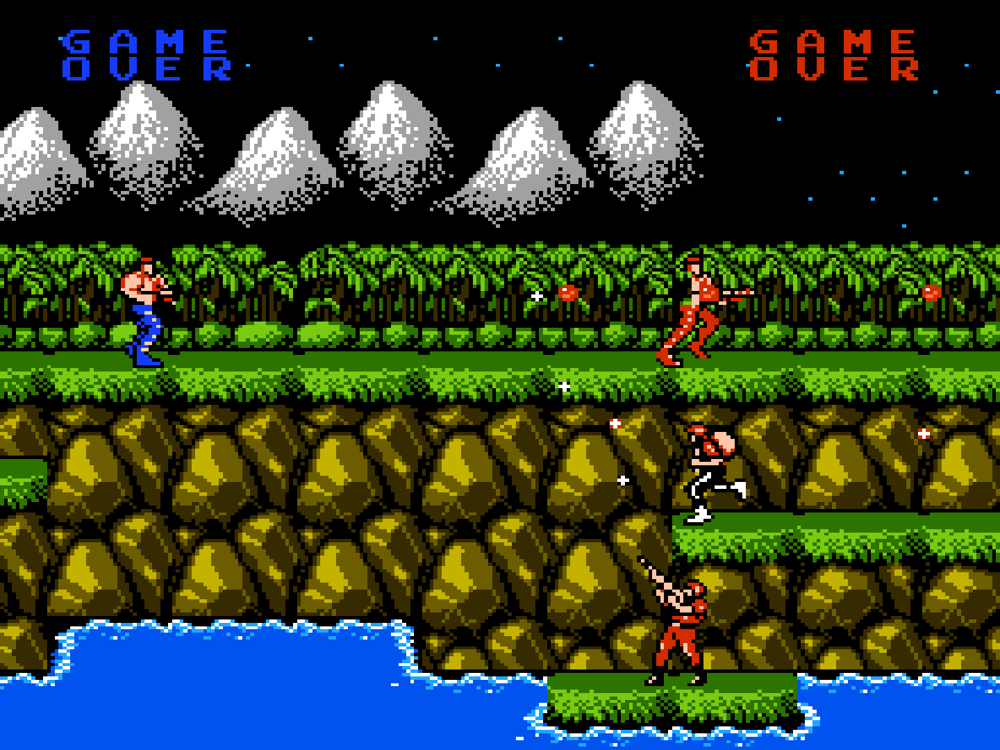

- **Game Genie Sound Distortion** (**Off**/On): Awaiting description.
- **Favored System** (**auto**/ntsc/pal/famicom/dendy): Choose which region the system is from. 'auto' will use the [NstDatabase.xml](https://doc.libretro.com/library/nestopia_ue/index.html#nstdatabasexml) database file for region autodetection. If there is no database present it will default to NTSC for 'auto'.
- **RAM Power-on State** (**0x00**/0xFF/random): Awaiting description.
- **Turbo Pulse Speed** (**2**/3/4/5/6/7/8/9): Set the turbo pulse speed for the Turbo B and Turbo A buttons.

## Controllers

*The Nestopia UE core supports the following controller setting(s), bolded controller settings are the default for the specified user(s):*

### User 1 - 16 Device Type(s)

* **RetroPad** - Joypad

* RetroPad w/Analog - Joypad - **There is no reason to switch to this.**

### Controllers graph

| Nestopia UE            | RetroPad                                                       |
|------------------------|----------------------------------------------------------------|
| B           		     |                |
| Turbo B     			 |                |
| Select                 |            |
| Start       			 |              |
| D-Pad Up    	         |             |
| D-Pad Down             |           |
| D-Pad Left  			 |           |
| D-Pad Right 			 |          |
| A           	 		 |                |
| Turbo A             	 |                |
| (FDS) Disk Side Change |                    |
| (FDS) Eject Disk       |                    |
| (VSSystem) Coin 1)     |               |
| (VSSystem Coin 2)      |                    |
| (Famicom) Microphone   |                    |

| RetroMouse                                                      | Zapper           |
|-----------------------------------------------------------------|------------------|
|                | Crosshair        |
|                  | Trigger          |
|                 | Light On         |

## Compatibility

| Game                   | Issue                                                            |
|------------------------|----------------------------------------------------------------- |
| Skull & Crossbones     | Graphical glitches and screen shaking when in 2-player mode. (1) |

??? note "(1)"
	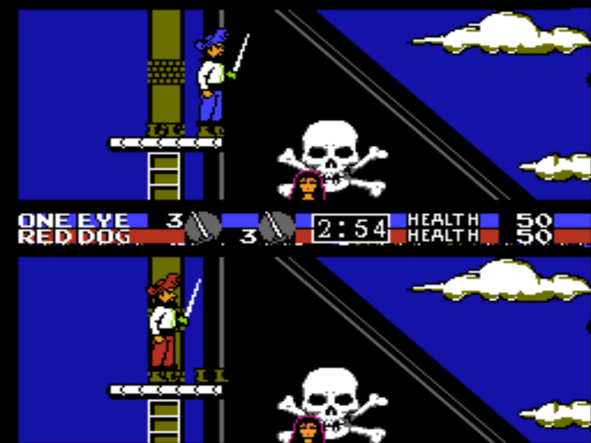

## External Links

* [Core info file](https://github.com/libretro/libretro-super/blob/master/dist/info/nestopia_libretro.info)
* [Libretro Github Repository](https://github.com/libretro/nestopia)
* [Report Core Issues Here](https://github.com/libretro/libretro-meta)
* [Official Website](http://0ldsk00l.ca/nestopia/)
* [Official Github Repository](https://github.com/rdanbrook/nestopia)