# Tomb Raider (OpenLara)

## Contribute to this documentation

In order to propose improvements to this document, [visit its corresponding source page on github](https://github.com/libretro/docs/tree/master/docs/library/openlara.md). Changes are proposed using "Pull Requests."

## Background

A new work-in-progress Tomb Raider game engine ported to libretro.

## Requirements

This core requires that you use OpenGL as the video driver. Go to Settings -> Driver. If ‘video driver’ is set to ‘vulkan’, switch it back to ‘gl’, and then restart.

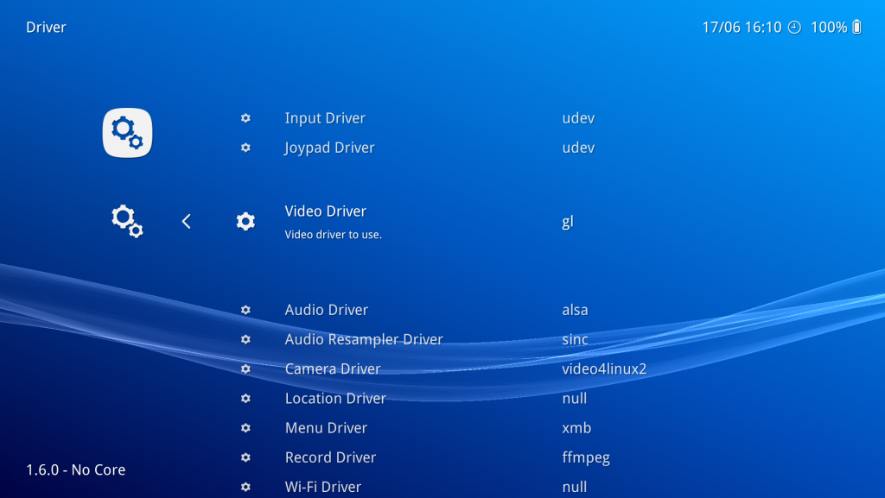

!!! warning 
	There is currently no ‘working’ macOS version available because of the aforementioned reason. Please be patient and keep the faith, we have not forgotten about macOS users and we have not relegated them to second-class citizen either. Just going to take a little bit of time before we sort this out.

The OpenLara core requires that you turn on ‘Enable Shared Hardware Context’, otherwise you will only see a single texture being displayed onscreen instead of the game screen.

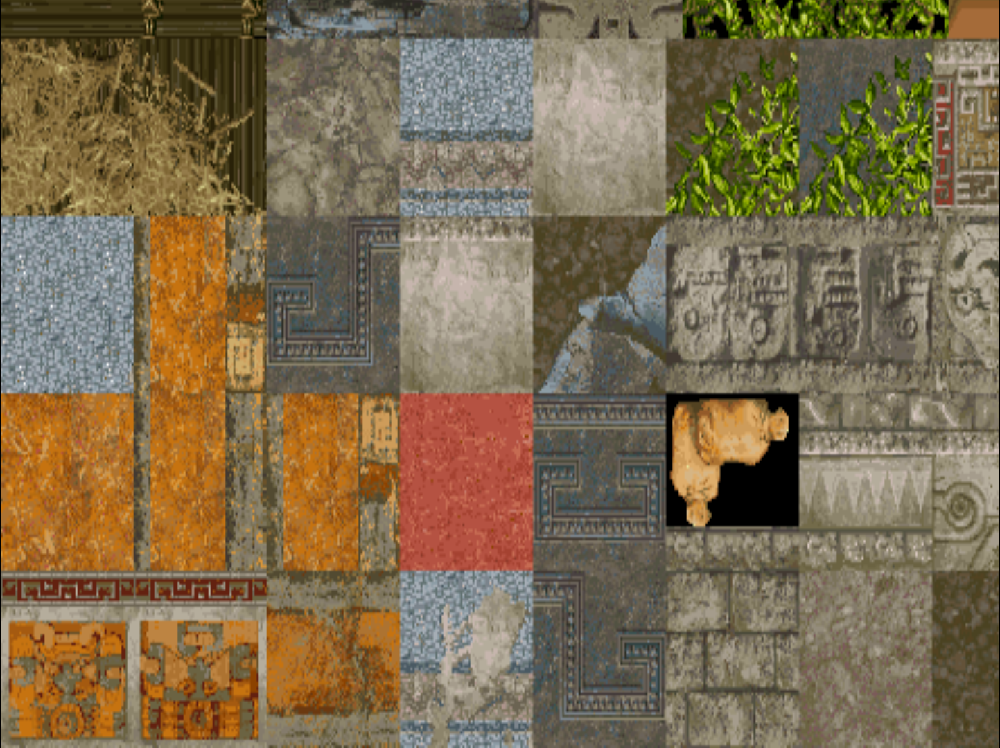

1. First, you need to ensure that ‘Show Advanced Settings’ is turned on. Go to Settings -> User Interface and turn ‘Show Advanced Settings’ on.

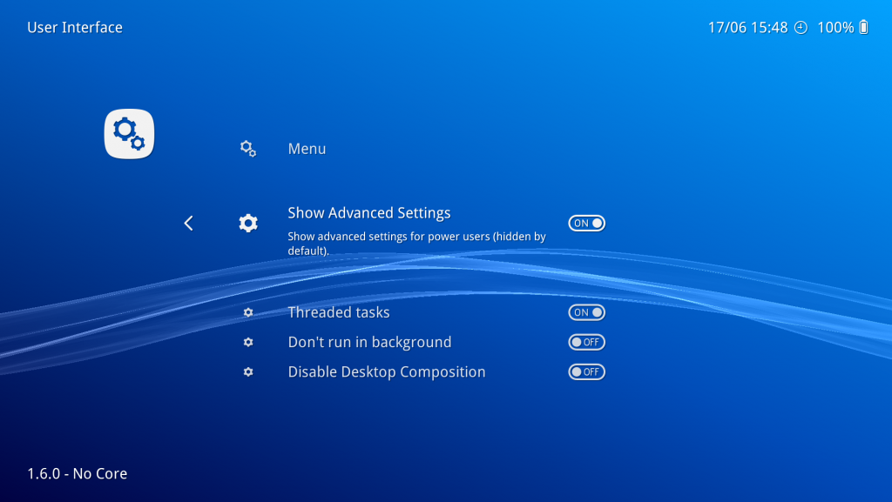

2. Now, go back, and go to Settings -> Core.

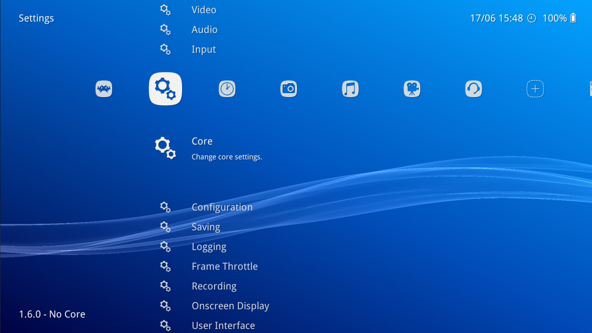

3. Once inside the ‘Core’ settings, set ‘Enable Shared Hardware Context’ to ON.

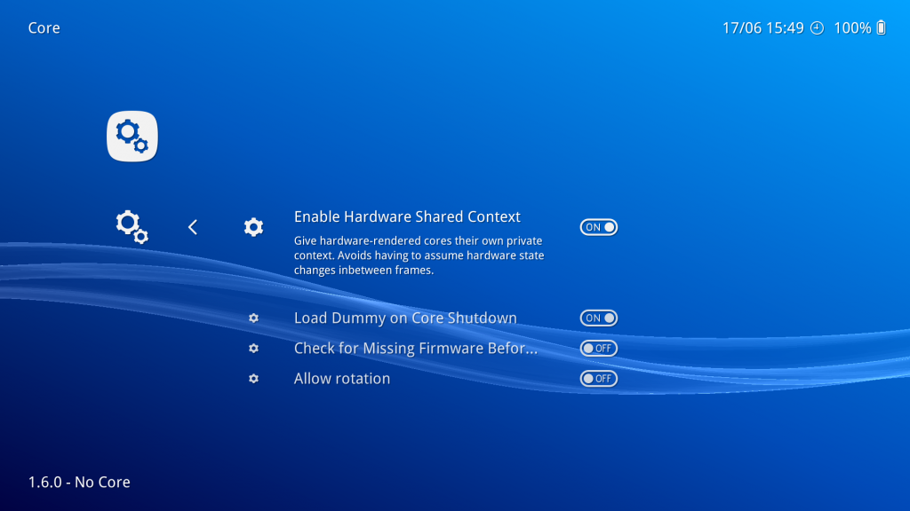

### How to get and install the OpenLara core:

1. Start up RetroArch. Inside the main menu, go to 'Online Updater'.

2. Just to make sure we have the latest info files, select 'Update Core Info FIles'. Wait until this is done. Then, select 'Core Updater'.

3. Browse through the list and select 'Tomb Raider (OpenLara)'.

After this has finished downloading, the core should now be ready for use!

#### How to play (after installation):

Right now, OpenLara is more of a tech demo. You have to load separate levels into the program in order to play them. 

Be aware that certain gameplay elements are simply not implemented as of yet, such as health bars, taking damage, etc. You can ‘complete’ the stage technically but you also cannot die or continue to the next level. 

We hope that it will book major progress so that one day we can replay the old Tomb Raider games entirely with these enhanced graphics and enhanced framerates. To this end, we intend to support the project.

**For demonstration purposes, we provide you with the Tomb Raider 1 demo levels so that you can test it out. It is also possible to use levels from the PC/PSX version and load this into the game engine core, so try that out at your own discretion.**

#### Example demo levels

Go to RetroArch's main menu. From there, select 'Content Downloader'.

2. Select 'Tomb Raider', then select 'tombraider1-demo.zip'. This should download and extract this file to RetroArch's Downloads directory.

3. Go back to RetroArch's main menu screen. Select 'Load Content', then 'Downloads'.

4. Select the 'Tomb Raider' directory, then select 'LEVEL2.PSX'.

5. If you are asked which core to select, choose 'Tomb Raider (OpenLara)'.

The game should now start running! OpenLara should now be at Level 2 of Tomb Raider 1

### Authors

- XProger

## License

A summary of the licenses behind RetroArch and its cores have found [here](https://docs.libretro.com/tech/licenses/).

- [2-clause BSD](https://github.com/XProger/OpenLara/blob/master/README.md)

## Extensions

Content that can be loaded by the OpenLara core have the following file extensions:

- .psx

## Databases

RetroArch database(s) that are associated with the OpenLara core:

- [Tomb Raider](https://github.com/libretro/libretro-database/blob/master/rdb/Tomb%20Raider.rdb)

## Features

| Feature           | Supported |
|-------------------|:---------:|
| Restart           | ✕         |
| Screenshots       | ✔         |
| Saves             | ✕         |
| States            | ✕         |
| Rewind            | ✕         |
| Netplay           | ✕         |
| Core Options      | ✔         |
| RetroAchievements | ✕         |
| RetroArch Cheats  | ✕         |
| Native Cheats     | ✕         |
| Controls          | ✔         |
| Remapping         | ✔         |
| Multi-Mouse       | ✕         |
| Rumble            | ✕         |
| Sensors           | ✕         |
| Camera            | ✕         |
| Location          | ✕         |
| Subsystem         | ✕         |
| Softpatching      | ✕         |
| Disk Control      | ✕         |
| Username          | ✕         |
| Crop Overscan (in RetroArch's Video settings) | ✕         |

### Directories

The OpenLara core's directory name is 'OpenLara'

Awaiting description.

### Core provided aspect ratio

OpenLara's core provided aspect ratio is 4/3.

### Enhancements

The nice thing about OpenLara is that, while staying true to the original look and feel of the original, it also adds some graphical enhancements to it that manages to make the boxy old-school Tomb Raider games look a bit less archaic. Some examples include :

- Self-shadowing on Lara, enemies, etc.
- New water effects which replaces the simple vertex manipulation of the water surface on the PSX. The Saturn version actually was the only version that tried to do something a bit more sophisticated with the water. If you dislike these very nice graphical enhancements, I inserted a core option so you can turn these off (‘Enable water effects’ in Quick Menu -> options).
- Shading effects – after Lara gets out of the water, her skin has a slightly wet shading effect.
- A first-person mode that is more convincing and fun than what you’d expect. It behaves a bit like Mirror’s Edge in that the camera bobs up and down, and you can see Lara’s hands move in front of you. If you try to do a somersault – the camera will rotate along with it as well. What makes the firstperson mode a bit more convincing is the new self-shadowing effects that have been added.

## Core options

The OpenLara core has the following option(s) that can be tweaked from the core options menu. The default setting is bolded. Settings with (Restart) means that core has to be closed for the new setting to be applied on next launch.

- **Framerate (restart)** (**60fps**/90fps/120fps/144fps/30fps)

 Self explanatory. 

- **Internal resolution (restart)** (**320x240**/360x480/480x272/512x384/512x512/640x240/640x448/640x480/720x576/800x600/960x720/1024x768/1024x1024/1280x720/1280x960/1600x1200/1920x1080/1920x1440/1920x1600/2048x2048/2560x1440/3840x2160/7680x4320/15360x8640/16000x9000)

 Self explanatory. 

??? note "Internal resolution - 320x240"
	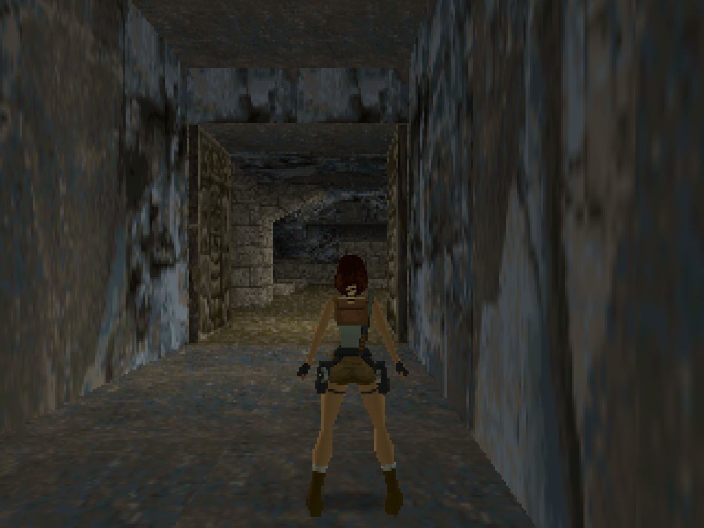

??? note "Internal resolution - 1920x1080"
	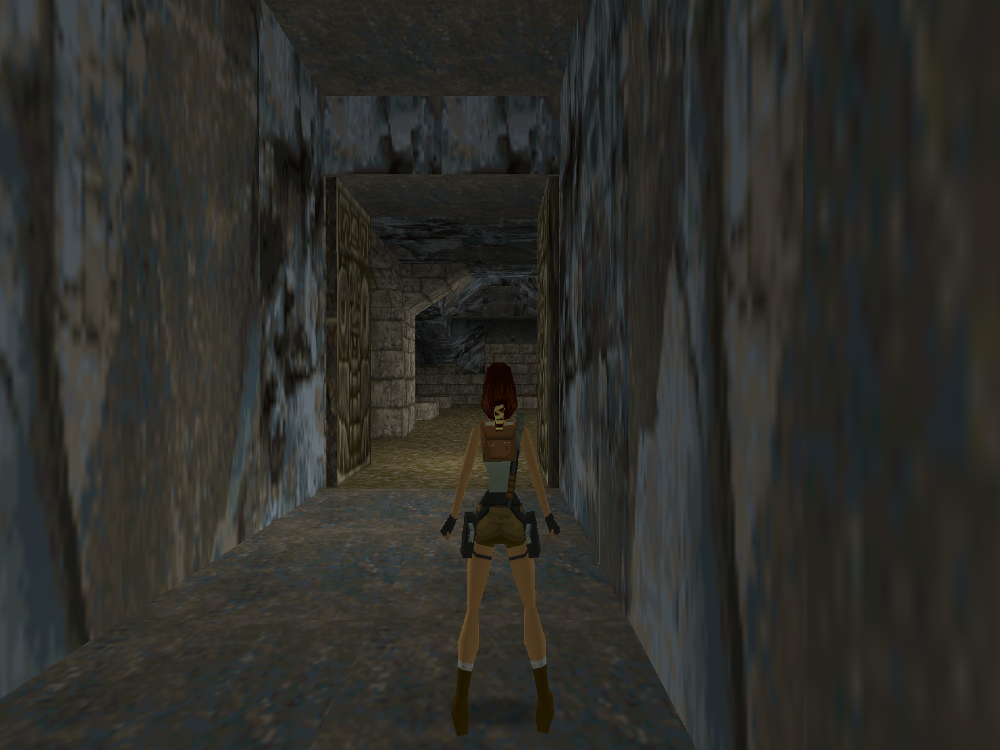

- **Texture filtering (restart)** (**Bilinear filtering**/Nearest)

 Self explanatory. 

??? note "Texture filtering - Bilinear"
	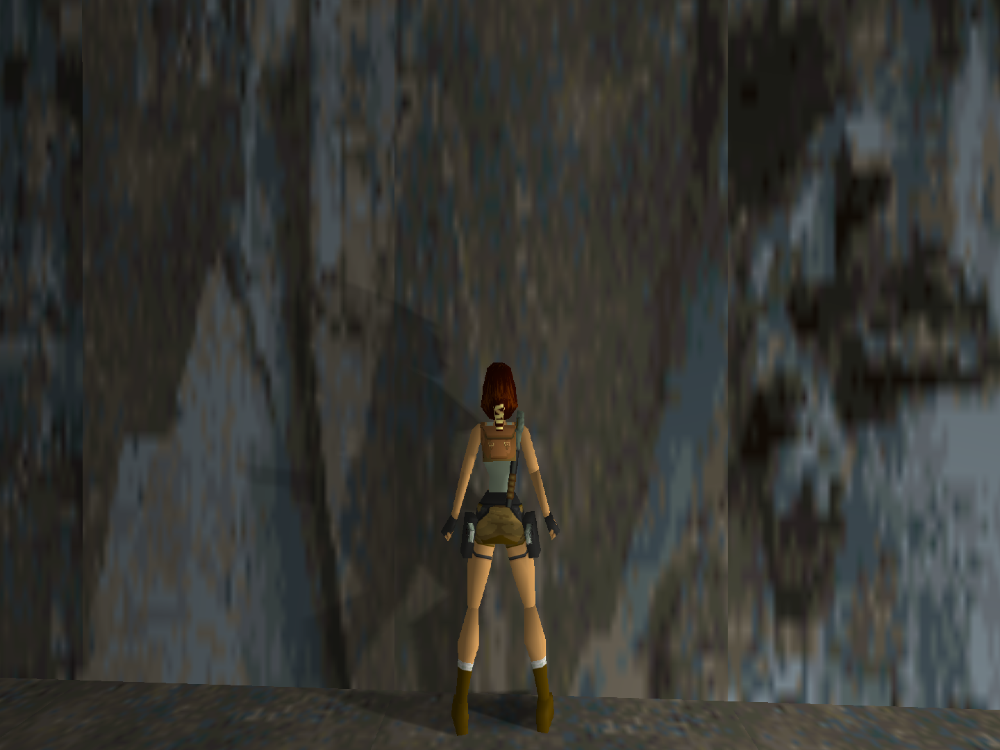
	

??? note "Texture filtering - Nearest"
	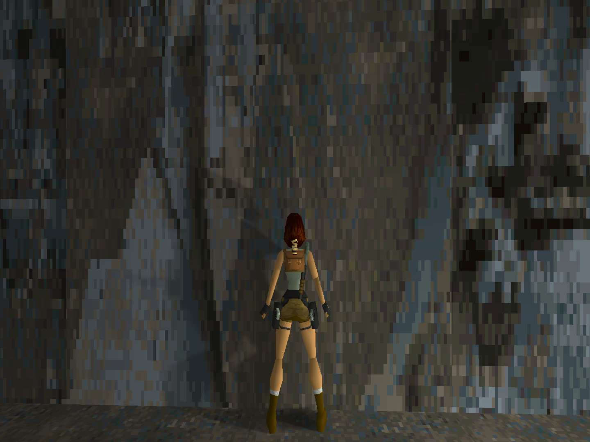
	

	

- **Water effects (restart)** (Off/**On**)

 Self explanatory. 

??? note "Water effects - On"
	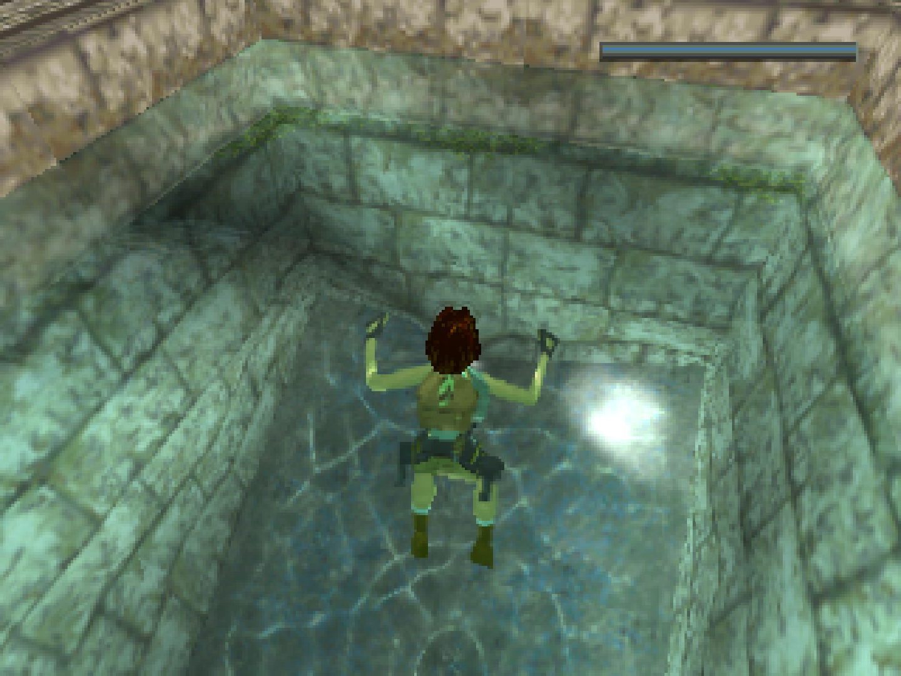
	

??? note "Water effects - Off"
	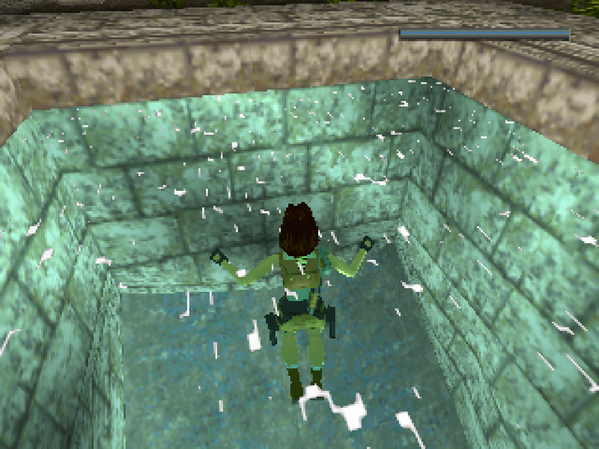
	

## Controllers

### Device types

The OpenLara core supports the following device type(s) in the controls menu, bolded device types are the default for the specified user(s):

#### User 1 device types

- None - Input disabled.
- **RetroPad** - Joypad
- RetroPad w/Analog - Joypad - **There is no reason to switch to this.**

### Controller tables

#### Joypad and analog device type table

| User 1 input descriptors      |                                              | RetroPad            |
|-------------------------------|----------------------------------------------|---------------------|
| Action (Shoot/grab)           |        | Action (Shoot/grab) |
| Jump                          |        | Jump                |
| View toggle                   |         | View toggle         |
| Inventory                     |          | Inventory           |
| Up                            |        | Up                  |
| Down                          |      | Down                |
| Left                          |      | Left                |
| Right                         |     | Right               |
| Roll                          |        | Roll                |
| Draw weapon                   |        | Draw weapon         |
| Walk (when holding)           |             | Walk (when holding) |
| Sidestep left                 |             | Sidestep left       |
| Sidestep right                |             | Sidestep right      |

## External Links

- [Libretro OpenLara Core info file](https://github.com/libretro/libretro-super/blob/master/dist/info/openlara_libretro.info)
- [Libretro OpenLara Github Repository](https://github.com/libretro/OpenLara)
- [Report Libretro OpenLara Core Issues Here](https://github.com/libretro/libretro-meta/issues)
- [Official OpenLara Github Repository](https://github.com/XProger/OpenLara)
- [OpenLara WebGL build with demo level](http://xproger.info/projects/OpenLara/)
