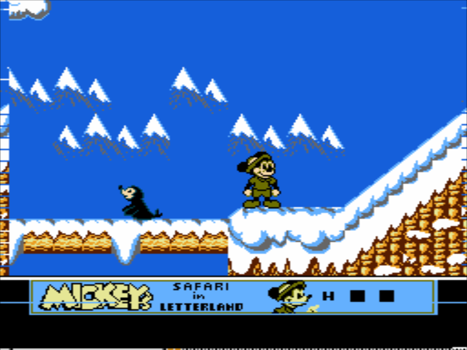

# NES / Famicom (QuickNES)

## Background

Nes_Emu, the core NES emulator library used by QuickNES, began as a very simple NES emulator sometime in 2004. It was based on the 6502 CPU core and APU sound core used in the Game_Music_Emu sound engine. 

### Why use this core?

-

### Author(s):

blargg|kode54

## Contribute to this documentation

In order to propose improvements to this document, [visit it's corresponding source page on github](https://github.com/libretro/docs/tree/master/docs/library/quicknes.md). Changes are proposed using "Pull Requests."

## See also

[NES / Famicom (bnes)](https://doc.libretro.com/library/bnes/)

[NES / Famicom (Emux)](https://doc.libretro.com/library/emux_nes/)

[NES / Famicom (FCEUmm)](https://doc.libretro.com/library/fceumm/)

[NES / Famicom (Nestopia UE)](https://doc.libretro.com/library/nestopia_ue/)

## License

LGPLv2.1+

## Extensions

*Content that can be loaded by the QuickNES core have the following file extensions.*

nes

## Database(s)

*RetroArch database(s) that are associated with the QuickNES core*

* Nintendo - Nintendo Entertainment System

* Nintendo - Family Computer Disk System

## Features

| Feature           | Supported |
|-------------------|:---------:|
| Saves             | ✔         |
| States            | ✔         |
| Rewind            | ✔         |
| Netplay           | ✔         |
| RetroAchievements | ✔         |
| RetroArch Cheats  | ✕         |
| Native Cheats     | ✕         |
| Controllers       | ✔         |
| Remapping         | ✔         |
| Multi-Mouse       | ✕         |
| Rumble            | ✕         |
| Sensors           | ✕         |
| Camera            | ✕         |
| Location          | ✕         |
| Subsystem         | ✕         |

The QuickNES core's directory name is 'QuickNES'

Game data is saved/loaded to and from where save files are stored.

Save states are saved/loaded to and from where state files are stored. 

## Controllers

*The QuickNES core supports the following controller setting(s), bolded controller settings are the default for the specified user(s):*

### User 1 - 16 Device Type(s)

* **RetroPad** - Joypad

* RetroPad w/Analog - Joypad - **There is no reason to switch to this.**

### Controllers graph

| QuickNES    | RetroPad                                                       |
|-------------|----------------------------------------------------------------|
| B           |                |
| Select      |            |
| Start       |              |
| D-Pad Up    |             |
| D-Pad Down  |           |
| D-Pad Left  |           |
| D-Pad Right |          |
| A           |                |

## Compatibility

| Game                          | Issue                                                                    |
|-------------------------------|--------------------------------------------------------------------------|
| Burai Fighter                 | Softlocks when entering a level.                                         |
| Crisis Force                  | Crashes on start.                                                        |
| Family Circuit '91            | Crashes on start.                                                        |
| Gradius II                    | Crashes on start.                                                        |
| Huge Insect                   | No enemies spawn.                                                        |
| Lagrange Point                | Crashes on start.                                                        |
| Mickey's Safari in Letterland | Graphical glitches on the sides of the screen and on the status bar. (1) |
| Ms. Pac-Man (Tengen version)  | Graphical glitches on the sides of the screen.                           |
| Skull & Crossbones            | Crashes on start.                                                        |

??? note "(1)"
    

## External Links

* [Libretro Repository](https://github.com/libretro/QuickNES_Core)
* [Report Core Issues Here](https://github.com/libretro/libretro-meta)
* [Official Repository](https://github.com/kode54/QuickNES)