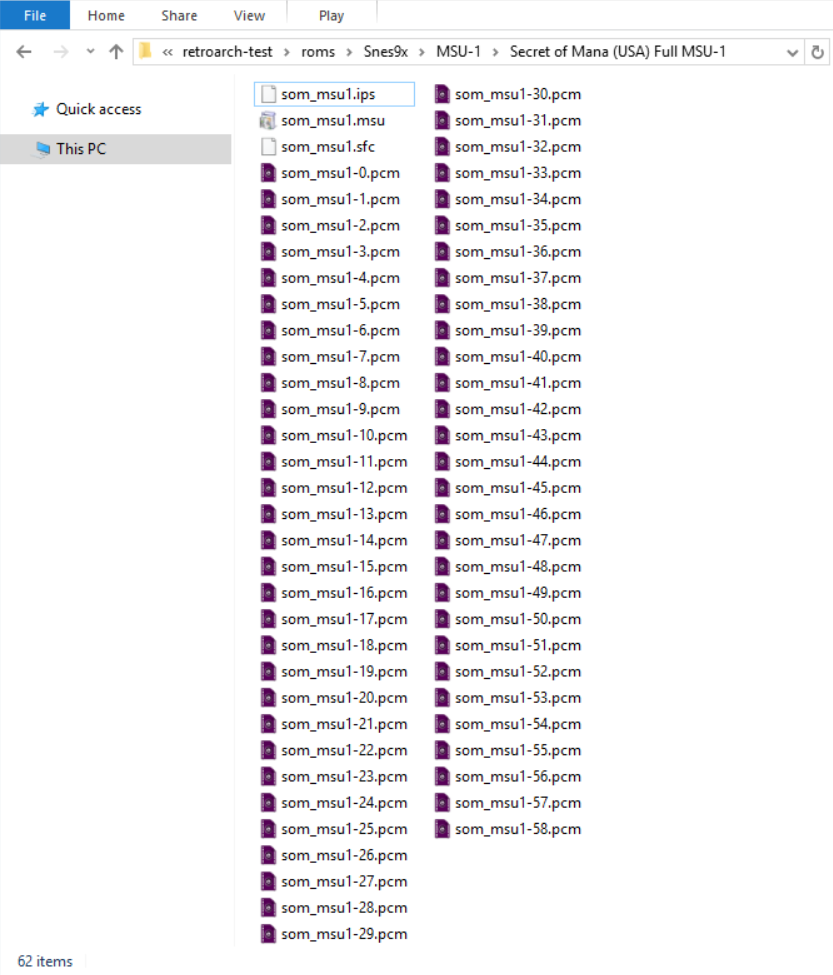
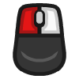

# SNES / Super Famicom (Snes9x)

## Background

Port of upstream mainline **up-to-date** Snes9x, a portable Super Nintendo Entertainment System emulator to libretro.

### Why use this core?

- Highly accurate SNES emulation.
- Simplified and easily accessible MSU-1 expansion chip support.
- Recommended for netplay
- Less CPU intensive than the higan/bsnes based cores.
- **Most up-to-date libretro Snes9x core available.**

### Authors

Snes9x Team

## Contribute to this documentation

In order to propose improvements to this document, [visit it's corresponding source page on github](https://github.com/libretro/docs/tree/master/docs/library/snes9x.md). Changes are proposed using "Pull Requests."

## See also

- [Beetle bsnes](https://doc.libretro.com/library/beetle_snes/)
- [bsnes Accuracy](https://doc.libretro.com/library/bsnes_accuracy)
- [bsnes Balanced](https://doc.libretro.com/library/bsnes_balanced)
- [bsnes C++98 (v085)](https://doc.libretro.com/library/bsnes_cplusplus98)
- [bsnes Performance](https://doc.libretro.com/library/bsnes_performance)
- [bsnes-mercury Accuracy](https://doc.libretro.com/library/bsnes_mercury_accuracy)
- [bsnes-mercury Balanced](https://doc.libretro.com/library/bsnes_mercury_balanced)
- [bsnes-mercury Performance](https://doc.libretro.com/library/bsnes_mercury_performance)
- [higan Accuracy](https://doc.libretro.com/library/higan_accuracy)
- [Snes9x 2002](https://doc.libretro.com/library/snes9x_2002)
- [Snes9x 2005 Plus](https://doc.libretro.com/library/snes9x_2005_plus)
- [Snes9x 2005](https://doc.libretro.com/library/snes9x_2005)
- [Snes9x 2010](https://doc.libretro.com/library/snes9x_2010)

## License

Non-commercial

## Extensions

Content that can be loaded by the Snes9x core have the following file extensions:

- .smc
- .sfc
- .swc
- .fig

## Databases

RetroArch database(s) that are associated with the Snes9x core:

- [Nintendo - Super Nintendo Entertainment System](https://github.com/libretro/libretro-database/blob/master/rdb/Nintendo%20-%20Super%20Nintendo%20Entertainment%20System.rdb)
- [Nintendo - Super Nintendo Entertainment System Hacks](https://github.com/libretro/libretro-database/blob/master/rdb/Nintendo%20-%20Super%20Nintendo%20Entertainment%20System%20Hacks.rdb)
- [Nintendo - Sufami Turbo](https://github.com/libretro/libretro-database/blob/master/rdb/Nintendo%20-%20Sufami%20Turbo.rdb)

## Features

| Feature           | Supported |
|-------------------|:---------:|
| Saves             | ✓         |
| States            | ✓         |
| Rewind            | ✓         |
| Netplay           | ✓         |
| RetroAchievements | ✓         |
| RetroArch Cheats  | ✓         |
| Native Cheats     | ✕         |
| Controllers       | ✓         |
| Remapping         | ✓         |
| Multi-Mouse       | -         |
| Rumble            | ✕         |
| Sensors           | ✕         |
| Camera            | ✕         |
| Location          | ✕         |
| Subsystem         | ✕         |
| Softpatching      | ✓         |

The Snes9x core's directory name is 'Snes9x'

- Game data is saved/loaded to and from where save files are stored.

- Save states are saved/loaded to and from where state files are stored.

### MSU-1 support

MSU-1 support in the Snes9x core follows the SD2SNES naming format, i.e.
```
gamename\
gamename.sfc
gamename.msu
gamename-#.pcm
```

Loading a manifest.bml file or having a xml file isn't necessary. **Just load gamename.sfc.**

Here's an example of a working MSU-1 setup done with [Secret of Mana MSU-1](https://www.romhacking.net/hacks/2467/). Please note that som_msu1.sfc is being [softpatched](https://buildbot.libretro.com/docs/guides/softpatching/) in this example.



## Core options

The Snes9x core has the following option(s) that can be tweaked from the core options menu. The default setting is bolded.

- **SuperFX Frequency** (**10MHz**/20MHz/40MHz/60MHz/80MHz/100MHz): Overclock the [SuperFX chip](https://en.wikipedia.org/wiki/Super_FX). 10Mhz is stock clockspeed.
- **Show layer 1** (Off/**On**): Self-explanatory.
- **Show layer 2** (Off/**On**): Self-explanatory.
- **Show layer 3** (Off/**On**): Self-explanatory.
- **Show layer 4** (Off/**On**): Self-explanatory.
- **Show sprite layer** (Off/**On**): Self-explanatory.
- **Enable graphic clip windows** (Off/**On**): Self-explanatory.
- **Enable transparency effects** (Off/**On**): Self-explanatory.
- **Enable sound channel 1** (Off/**On**): Self-explanatory.
- **Enable sound channel 2** (Off/**On**): Self-explanatory.
- **Enable sound channel 3** (Off/**On**): Self-explanatory.
- **Enable sound channel 4** (Off/**On**): Self-explanatory.
- **Enable sound channel 5** (Off/**On**): Self-explanatory.
- **Enable sound channel 6** (Off/**On**): Self-explanatory.
- **Enable sound channel 7** (Off/**On**): Self-explanatory.
- **Enable sound channel 8** (Off/**On**): Self-explanatory.
- **Crop overscan** (**auto**/On/Off): Crop out the potentially random glitchy video output that would have been hidden by the bezel around the edge of a standard-definition television screen.

??? note "Crop overscan - On"
	
	
??? note "Crop overscan - Off"
		

- **Preferred aspect ratio** (**auto**/ntsc/pal/4:3): Choose the preferred aspect ratio. RetroArch's aspect ratio must be set to Core provided in the Video seetings.

??? note "Preferred aspect ratio - ntsc"
	
	
??? note "Preferred aspect ratio - pal"
	

??? note "Preferred aspect ratio - 4:3"
		
	
## Controllers

The Snes9x core supports the following controller setting(s), bolded controller settings are the default for the specified user(s):

### User 1 Device Type(s)

- **[SNES Joypad](http://nintendo.wikia.com/wiki/Super_Nintendo_Entertainment_System_controller)** - Joypad 
- [SNES Mouse](https://en.wikipedia.org/wiki/Super_NES_Mouse) - Mouse
- [Multitap](http://nintendo.wikia.com/wiki/Super_Multitap) - Joypad - *Allows for up to five players to play together in certain games.*

### User 2 Device Type(s)

- **[SNES Joypad](http://nintendo.wikia.com/wiki/Super_Nintendo_Entertainment_System_controller)** - Joypad
- [SNES Mouse](https://en.wikipedia.org/wiki/Super_NES_Mouse) - Mouse
- [Multitap](http://nintendo.wikia.com/wiki/Super_Multitap) - Joypad - *Allows for up to five players to play together in certain games.*
- [SuperScope](https://en.wikipedia.org/wiki/Super_Scope) - Lightgun
- [Justifier](https://en.wikipedia.org/wiki/Konami_Justifier) - Lightgun

### User 3 - 16 Device Type(s)

- **RetroPad** - Joypad

### Controllers graph

| Snes9x      | RetroPad                                                       |   SNES Joypad / Multitap                                |
|-------------|----------------------------------------------------------------|---------------------------------------------------------|
| B           |                |            |
| Y           |                |            |
| Select      |            |  |
| Start       |              |    |
| D-Pad Up    |             |      |
| D-Pad Down  |           |      |
| D-Pad Left  |           |      |
| D-Pad Right |          |      |
| A           |                |            |
| X           |                |            |
| L           |                    |            |
| R           |                    |            |

| RetroMouse                                                      |  SNES Mouse  |  SuperScope  |  Justifier  |
|-----------------------------------------------------------------|--------------|--------------|-------------|
|                | Pointer      | Pointer      | Pointer     |
|                  | Left Button  | Trigger      | Trigger     |
|              |              | Cursor       | Start       |
|                | Right Button | Turbo        | Offscreen   |
|    |              | Pause        |             |

- All of the Super Scope games made by Nintendo have a soft-reset to the game's main title. This is accomplished by pausing the game, then, while holding Cursor, the Fire button must be pressed twice.

## Compatibility

| Game                                             | Issue                                                                                |
|--------------------------------------------------|--------------------------------------------------------------------------------------|
| A.S.P. Air Strike Patrol                         | The shadow below the aircraft is missing. Glitched graphics on the briefing screens. |
| BS-Zelda MottZilla Patch                         | Only shows a black screen.                                                           |
| Doom                                             | Colored dots appear during gameplay.                                                 |
| Funaki Masakatsu Hybrid Wrestler – Tougi Denshou | Corrupted graphics on the Pancrase logo screen.                                      |
| Hayazashi Nidan Morita Shougi 2                  | Matches won’t start.                                                                 |
| Mecarobot Golf                                   | The ground "wobbles" during gameplay.                                                |
| Secret of Evermore (PAL versions)                | Randomly freezes when the background music changes.                                  |
| Speedy Gonzales: Los Gatos Bandidos              | Freezes when pressing a switch in the last level.                                    |

- Snes9x can launch some Satellaview games with sometimes low compatibility.

## External Links

- [Core info file](https://github.com/libretro/libretro-super/blob/master/dist/info/snes9x_libretro.info)
- [Libretro Repository](https://github.com/libretro/snes9x)
- [Report Core Issues Here](https://github.com/libretro/snes9x/issues)
- [Official Website (no longer updated)](http://www.snes9x.com/)
- [Official Github Repository](https://github.com/snes9xgit/snes9x)
- [Official Upstream Downloads](http://www.s9x-w32.de/dl/)
- [Alternate Official Upstream Downloads](https://sites.google.com/site/bearoso/)