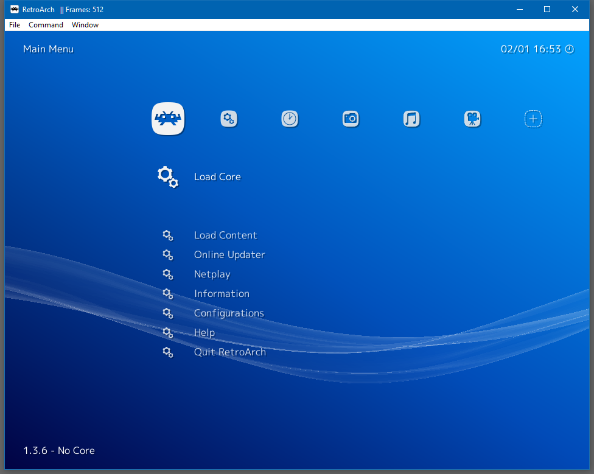

# Getting Started with RetroArch

## Installing RetroArch

You can either download a stable release [here](https://buildbot.libretro.com/stable/1.3.6/windows/) or a current nightly [here](https://buildbot.libretro.com/nightly/windows/).
There are several files you can download in these folders. For a new installation you want **RetroArch.7z**.

Extract **RetroArch.7z** in a folder that doesn't require administrator permissions such as *C:\Users\yourusername\RetroArch*. Don't install to *Program Files* or your Windows folder.

This distribution method has several advantages:
- It's portable
- It's self-contained
- It doesn't need users to guess random locations for configurations files
- It's easy to update

## Updating RetroArch

If you were running a stable release prior to 1.4.0. you will need to update the system libraries. You can do so by downloading the full **RetroArch.7z** package or grabbing **redist.7z** from the aforementioned locations.
To update RetroArch it's enough to download the current dated **2017-XX-XX_RetroArch.7z** and extract it on-top of your existing installation.

## Using RetroArch
### First Run

At first you will be greeted by this screen:

## Glossary

- Frontend — a frontend in libretro's context is a program designed to run libretro cores such as Kodi's RetroPlayer, RetroArch, Phoenix, Minir
- Core — a core is a program that has been ported to the libretro API and runs inside a libretro frontend
- Content — content can be a game, an image, a video, an audio file that is executed by a core. In most cases contents are the ROMs of an emulated platform
- RetroPad — retropad is RetroArch’s input abstraction controller, it’s the interface between the physical controller and the core inputs
- Save files — save files are saves that are made from within a game, usually cross platform and should work across emulators in most cases
- Save states — save states are snapshots of the content menory at a particular moment, these are not always cross platform and most certainly won’t work on a different emulator that the one used to create them
- System files — additional files that might or not be part of the romset that might be needed to get some content to work (usually referred to by the BIOS term)
- Autoconf profile — a configuration file that has button definitions for a particular gamepad

